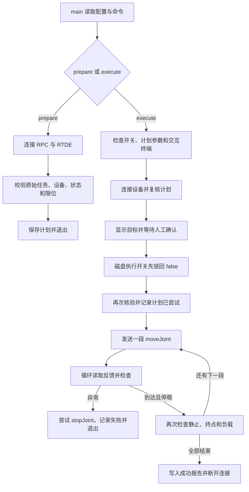

# AUBO S3 使用与控制手册：手机操作、NUC 连接与程序控制

编写日期：2026-10-02。适用设备：实验室的 AUBO S3、NUC `asusNUC05`、Android AuboStudio。

本文中的设备配置和运动结果来自 **2026-09-30 的实测记录**，不是今天的实时状态；NUC 的 Wi-Fi IP、密码和设备设置可能随后改变。本次编写只查阅资料，没有连接或操作机械臂。

**这是一份含现场账号密码的本地手册，供组内使用，不上传公开 GitHub。**

阅读路线：第 1～10 节用于现场操作；第 11～13 节解释 NUC 项目的全部自编 Python/Shell 文件、调用关系和关键代码；第 14 节说明早期 WSL 版本，第 15 节给出比赛工程的源码索引。**第 16 节逐步讲解实机成功的 `j6_45_fast.py`，包括具体函数、监测公式、执行顺序和成功日志。** 源码结构及脚本讲解于 2026-10-02 按本地实际文件核对。

## 1. 先看懂谁连接谁

```text
你的电脑（Windows / WSL）
       │ SSH：aaet@10.11.65.49
       │ 经电脑与 NUC 之间可互通的网络
       ▼
NUC：Ubuntu 24.04，主机名 asusNUC05
  Wi-Fi 网卡 wlo1：10.11.65.49       ← 用于远程登录
  有线网卡 enp86s0：192.168.3.250
       │ 网线，接控制柜指定的 LAN / 网络口
       ▼
AUBO 控制柜：有线地址 192.168.3.100
       │ 本体专用连接线
       ▼
AUBO S3 六轴机械臂

Android 手机 / 平板
       │ 连接控制柜发出的 Wi-Fi 热点
       └── AuboStudio → 控制柜无线地址 192.168.2.1
```

同一个控制柜可以在无线侧和有线侧使用不同地址。**手机连 `192.168.2.1`，NUC 程序连 `192.168.3.100`，电脑 SSH 连 `10.11.65.49`。** 手机与 NUC 不必直接互通，它们各自连接控制柜。

NUC 相当于运行 Python 程序的电脑；控制柜负责驱动关节。手机 App 相当于操作面板，用于查看状态、上电、点动和示教。只使用手机点动时，不需要启动 NUC 上的 Python 程序。

## 2. 地址、账号、密码速查

| 用途 | 地址 / 名称 | 账号 | 密码 | 依据及注意事项 |
|---|---|---|---|---|
| 电脑 SSH 登录 NUC | `10.11.65.49` | `aaet` | **`1234`** | 用户提供，9 月 30 日连接时使用；IP 可能随网络变化 |
| NUC 的 sudo 提权 | NUC 终端 | `aaet` | **`1234`** | 使用 NUC 账户密码，未修改时同上 |
| 手机连接机械臂 Wi-Fi | 实验室资料描述为带 `aubo` / `s3` 的热点；完整 SSID 未记录 | 无 | **默认 `12345678`** | 官方出厂默认值；未读取本机当前热点密码，改过则以现场为准 |
| 手机 App 连接控制柜 | `192.168.2.1` | 按 App 实际提示 | 未记录独立 App 登录口令 | IP 来自实验室 PDF；不要把下面的 SDK 密码当作所有 App 页面密码 |
| NUC 的 Python SDK 登录控制柜 | `192.168.3.100:30004` | **`aubo`** | **`123456`** | 本次 SDK 调试使用的登录组合 |
| Studio 的操作模式 / 安全配置权限 | App 内相应设置 | 由现场权限配置决定 | **未记录** | 与 SSH、SDK、Wi-Fi 密码分别管理，不能相互代替 |
| NUC 所连的校园 Wi-Fi | 上次记录为 `PolyUWLAN` | 按校园网络要求 | **本文没有该网络凭据** | 机械臂热点的 `12345678` 不适用于这里 |

官方确认热点默认密码为 `12345678`，热点名称可能带控制器型号和序列号后缀。应核对本台设备标签，避免连到旁边的另一台机械臂。[官方无线连接说明](https://developer.aubo-robotics.cn/software_manual/v2.3/01_quick_start/01_install_open.html)

| 软件 / 项目 | 本次实测配置 |
|---|---|
| 控制柜 ARCS | `0.25.6-alpha.1+c24e317c` |
| 控制器接口代码 | `24000`，对应接口 `0.24.0` |
| Python SDK | `pyaubo-sdk 0.24.1`，Python 3.10 |
| NUC 独立 Conda 环境 | `aubo-s3-hardware` |
| NUC 实机目录 | `/home/aaet/aubo_s3_nuc_smoke/hardware` |
| WSL 对应目录 | `/home/chang/aubo_s3_nuc_smoke/hardware` |

## 3. 接线与控制柜开机

在断电状态按设备手册接好本体线、控制柜电源、急停手柄及规定附件，确认机械臂底座固定。普通网线连接 **NUC 网口 → 控制柜指定网络口**；不要把网线插入外形相似的专用接口。

实验室 PDF 给出的启动方式是：接通电源后，长按手柄上的开机键，等待控制器启动提示。具体键名、位置以本台控制柜及手柄为准。

要分清三个阶段：

| 阶段 | 发生什么 |
|---|---|
| 控制柜开机 | 控制系统启动，之后手机才能发现热点并连接 |
| App 中“上电” | 关节驱动进入上电、初始化流程 |
| App 中“启动” | 释放制动器，机械臂进入可受控状态 |

手机不能给未接通电源的控制柜凭空开机。“启动”涉及真实机械部件，应先清空机械臂及工具扫过的区域，现场有人掌控实体急停。手机界面、SSH 和 `Ctrl+C` 都不能替代实体急停。

## 4. 下载 App，并通过 Wi-Fi 连接

### 4.1 下载与版本选择

安装的是 **AuboStudio 安卓版移动端示教软件**，不是 AuboStudio 插件。

- [官方 App 下载页](https://developer.aubo-robotics.cn/download_center/soft_scope_download.html)
- [官方 APK 版本目录](https://download.aubo-robotics.cn/android/)
- [官方软件总下载中心](https://developer.aubo-robotics.cn/download_center/soft_download_center.html)

官方当前安装说明面向 Android 平板，要求 Android 10 及以上，推荐不低于 1280×800 的屏幕。Android 手机可按设备兼容情况安装，但应确认所有按钮完整显示，优先横屏；iPhone 不能安装这个 APK。[官方安装说明](https://developer.aubo-robotics.cn/application_notes/35-virtual-machine-connect-tablet/index.html)

**本机控制柜较旧，优先保留此前已经连接成功的 APK。** 其具体版本尚未记录。官方页面目前提供的 0.9.4 及目录中的更新版本，不能据此认定支持 ARCS 0.25.6。官方下架记录明确存在跨 ARCS 版本兼容限制；本次未找到 0.25.6 对应 APK 的确定映射。需要重装时，向设备提供方索取与 `0.25.6-alpha.1+c24e317c` 匹配的安装包，不为连接 App 随意升级控制柜。[官方版本兼容问题记录](https://download.aubo-robotics.cn/android/recall.log)

取得匹配版本后，在手机“文件管理”中打开 `.apk`，按提示允许该来源安装，完成后启动 AuboStudio。按系统实际提示授予所需权限。

### 4.2 手机连接机械臂热点

1. 等控制柜启动完成，打开手机的 **设置 → WLAN / Wi-Fi**。
2. 选择本台控制柜的热点，首次按默认密码 **`12345678`** 连接；密码已改则使用现场设置值。
3. 如果提示“此网络无法访问互联网”，选择**仍然连接 / 保持连接**。机械臂局域网没有互联网也能控制机械臂。若手机自动跳回其他网络，关闭相应自动切换功能后重连。
4. 打开 AuboStudio，进入“控制柜连接 / IP 列表”，刷新并选中本台控制柜；实验室记录中的无线 IP 为 **`192.168.2.1`**。允许手动输入时也可填此地址。
5. 点击“连接”，进入主页，核对型号 S3、设备身份和控制柜版本。

此处不要填写 NUC 的 SSH IP。若 `192.168.2.1` 不出现，先核对手机仍连接正确热点，再核对现场网络设置，不要反复尝试上电。无线 IP 与“上电 → 启动”流程来自用户提供的《S3技术说明文档-自整理-by zhangxuan》。

## 5. 在手机 App 上电、启动与看状态

不同 APK 的菜单位置可能不同。下面用本机实验室说明中的按钮名称描述流程；移动页面的细节另参考当前官方手册，其版本比本机新。

1. **确认设备和现场。** 核对连接的是本台 S3，没有其他程序正在控制它，工具、线缆及运动范围已检查。只有排除急停原因后，才按实体急停按钮标示解除急停。
2. **确认真实模式。** 在状态栏或模式设置找到“仿真”，进行实机操作时关闭；SDK 对应读数为 `simulation=false`。关闭仿真意味着后续命令可以作用于真实机械臂。
3. **核对负载与 TCP。** 9 月 30 日测试是裸法兰，配置外部负载 0 kg、TCP 偏移为零。装了夹爪、相机、转接板等，就要按实物配置重量、重心和工具中心点，不能直接沿用裸法兰设置。
4. 在 **主页 → 上电** 中确认实际负载，按界面提示继续，等待初始化。
5. 出现 **启动** 后点击，等待完成制动释放，确认机器人状态和安全状态正常。遇到报错先看日志，不连续反复点击。

负载表示机械臂末端带着多重的东西；TCP 是你希望精确控制的工具工作点，例如夹爪抓取中心。它们直接影响运动与负载相关判断。

| 界面或 SDK 状态 | 通俗含义 | 应怎么理解 |
|---|---|---|
| `PowerOff` | 本体驱动未上电 | 控制柜及 App 可能仍在线 |
| `Idle` | 通常是已上电、尚未完成启动 | 结合主页提示检查是否待“启动” |
| 机器人模式 `Running` | 本体已启动、可受控 | 不等于机械臂正在运动 |
| 安全状态 `Normal` | 当前安全状态正常 | 仍需核对现场空间与工具 |
| 安全状态 `Undefined` | 未得到可用的安全状态 | 停在准备阶段，检查初始化、连接和日志；不能手动把读数改成 Normal |
| `simulation=true` | 控制器仿真开启 | 界面中运动不能作为实机运动证据 |
| 程序运行时 `Stopped` | 没有正在运行的工程程序 | 与本体 `Running` 不冲突，本次 SDK 测试就是这个组合 |

上电和启动是主页操作；“播放工程”会运行已保存的动作程序。**不要为了让某个状态显示 Running 就播放不清楚内容的旧工程。** 本机状态含义及实测依据见 [STUDIO_SMOKE_45.md](/home/chang/aubo_s3_nuc_smoke/hardware/STUDIO_SMOKE_45.md)；通用流程见[官方上下电说明](https://developer.aubo-robotics.cn/software_manual/v2.3/01_quick_start/01_install_open.html)。

## 6. 用手机控制机械臂运动

### 6.1 先进入适合点动的操作模式

需要手动点动时，在状态栏的操作模式中选择 **手动 / Manual**，再进入 **移动 / 点动 / 示教** 页面。若要求操作模式密码，使用实验室设置的口令；此口令目前没有记录。

自动模式通常用于运行程序，移动和配置页面可能被锁定。因此，App 点动与此前 NUC 自动模式测试的界面条件不同。[官方操作模式说明](https://developer.aubo-robotics.cn/software_manual/v2.3/02_basic_operation/02_operational.html)

开始前停止其他运动程序，保留一个运动指令来源。手机可用于观察 NUC 测试状态，但不要在 NUC 发运动命令时同时点动、切模式或改速度比例。

### 6.2 首次练习：只操作 J6，先小幅验证

J1 到 J6 是从底座到末端的六个关节，J6 最靠近末端法兰。J6 转动时，偏心夹具和线缆仍会扫过空间。

1. 进入“移动”页面，找到 **关节 J1～J6** 控制区。
2. 将速度滑条设到适合现场的低档，先确认正在使用连续点动还是步进模式。
3. **连续 / 基础点动：** 按住 J6 的 `+` 或 `−` 使该关节转动，松开后观察机械臂停止。先短距离验证方向和停止行为。
4. **步进模式（若此 APK 支持）：** 设置小关节步长，例如 `0.1°`，单击一次后等待完成并核对读数，再考虑下一步。步进会完成所设的一步，不能把它理解为“松开手指就立即取消”。
5. `+` 表示关节角数值增大，`−` 表示减小；顺时针还是逆时针取决于观察方向。

**速度滑条的 `1%` 不等于 `1°/秒`。** 百分比是速度倍率；`°/秒` 才是角速度单位。此前程序中的 `1°/秒` 是 SDK 参数，不能用手机的 1% 直接替代。[官方连续与步进点动说明](https://developer.aubo-robotics.cn/software_manual/v2.3/09_move/01_jog.html)

### 6.3 想转到一个指定角度，怎么算

先区分两个说法：

- **转到 45°：** 最后 J6 的绝对角度为 45°。
- **再转 +45°：** 新目标等于本次读取的 J6 角度加 45°。

例如，当前 J6 为 10°，再转 +45° 的目标是 55°。这里只演示计算方法，不表示这个目标或途经空间已经检查过。

若当前 App 支持输入关节目标：读取并保留六个当前关节值，只修改 J6 的目标，确认 **J1～J5 目标仍等于各自当前值**，再按该版本“移动到目标 / 自动”按钮的操作提示执行。当前官方手册中需要长按“自动”；这只是移动页按钮，和“自动操作模式”不是一回事。

不要把“原点 / 零点 / 对齐”当成小幅复位按钮，它们可能同时改变多个关节。关节插补也不自动提供对桌面、工具、线缆的无碰撞保证。[官方目标位置及快捷按钮说明](https://developer.aubo-robotics.cn/software_manual/v2.3/09_move/01_jog.html)

### 6.4 XYZ 移动与关节移动有什么区别

J6 控制的是一个关节角；`X / Y / Z` 控制的是工具工作点的位置，`RX / RY / RZ` 控制工具朝向，可能需要多个关节一起运动。移动前要看清选择的是基座坐标系还是工具坐标系，例如工具 Z 轴未必朝天。初次了解设备时，先熟悉单关节读数和小幅点动。

## 7. 从电脑 SSH 登录 NUC

电脑需要与 NUC 所在网络可互通。Windows PowerShell 或 WSL 终端都可以执行：

```bash
ssh aaet@10.11.65.49
```

用户名是 **`aaet`**，密码是 **`1234`**。终端输入密码时不显示字符，输入完按回车即可。首次连接若询问主机指纹，核对是本台 NUC 后接受。

登录后可以只读查看：

```bash
hostname
ip -br addr
```

预期主机名是 `asusNUC05`。`10.11.65.49` 是上次 NUC 的 Wi-Fi 地址；若超时，应在 NUC 本机查看 `ip -br addr`，确认新地址及电脑网络。不要把机械臂的 `192.168.3.100` 直接替换进 NUC 的 SSH 命令。

退出远程终端使用 `exit`；这不会关闭 NUC，也不等于停止机械臂。

## 8. NUC 有线连接机械臂及只读检查

以下命令都在 **登录后的 NUC 终端**执行。NUC 与控制柜要在同一有线网段：本次 NUC 为 `192.168.3.250/24`，控制柜为 `192.168.3.100`，两者地址不能相同。

### 8.1 先看现有网络

```bash
ip -br addr
nmcli connection show
ip route get 192.168.3.100
```

正常情况下，最后一条显示去往机械臂的流量使用 `enp86s0`，源地址为 `192.168.3.250`。NUC 的 Wi-Fi 保留给 SSH；这条直连网线不需要默认网关。

上次创建的连接名是 `codex-aubo-smoke-temp`，只保存在内存，**重启 NUC 后可能已经消失**。仅在连接不存在、仍使用同一网卡和同一网段，且 `192.168.3.250` 无冲突时创建：

```bash
sudo nmcli connection add save no type ethernet ifname enp86s0 \
  con-name codex-aubo-smoke-temp ipv4.method manual \
  ipv4.addresses 192.168.3.250/24 ipv4.never-default yes \
  ipv6.method disabled connection.autoconnect no
sudo nmcli connection up codex-aubo-smoke-temp
```

`sudo` 密码是 NUC 账户密码 **`1234`**。若同名连接已存在，先检查 `nmcli connection show codex-aubo-smoke-temp` 的配置，确认正确后只执行 `up`，不要重复创建。不要更改校园 Wi-Fi 的地址或默认路由。

### 8.2 检查通信，然后读关节

```bash
ping -c 3 192.168.3.100
cd /home/aaet/aubo_s3_nuc_smoke/hardware
bash run.sh network --config commission.local.json
bash run.sh inspect --config commission.local.json
```

- `ping` 检查 IP 通信；不响应也可能是 ICMP 被禁用，继续看 TCP 检查结果。
- `network` 只测试配置中的 `192.168.3.100:30004` 能否建立 TCP 连接。
- `inspect` 提示 SDK 用户名时输入 **`aubo`**，密码输入 **`123456`**，然后读取设备身份、六关节角和状态，**不发送上电、模式切换或运动命令**。

这里显式指定 `commission.local.json`，使用已有实机配置；不指定时旧脚本默认寻找另一个配置文件。不要为读取状态而改动 `allow_motion=false` 和 `allow_fast_motion=false`。

读数中 `q_deg` 按顺序表示 `[J1, J2, J3, J4, J5, J6]`，单位为度；`q` 使用弧度；`tcp` 是工具位姿，不是六个关节角。可把 `q_deg` 与手机显示逐项对照。

`run.sh` 自动清理继承的 ROS/Python 环境变量，并激活 NUC 的独立 Conda 环境 `aubo-s3-hardware`。这条实机控制链使用厂商 SDK，不需要启动 ROS 2 或 Gazebo。WSL 负责远程登录，真正与控制柜通信的 Python 程序运行在 NUC 上。

## 9. NUC 程序如何让机械臂运动

流程是：**读取当前关节 → 计算目标 → 核对设备、状态与运动范围 → 人工确认 → 发送动作 → 监测反馈 → 核验停稳**。

本项目使用 `moveJoint`：给控制柜一个六关节目标、加速度和速度，由控制柜生成并执行关节运动。SDK 的角度用弧度：`1° = π/180 rad ≈ 0.0174533 rad`。它不是把“45”直接当成 45°，也不是让 NUC 逐个驱动电机。

| 参数 | 本次 J6 测试中的意义 |
|---|---|
| 目标关节数组 | 六个弧度值，仅 J6 目标改变，J1～J5 保持起点 |
| 加速度 | 最后一轮为 `1°/秒²`，转换后传入 |
| 速度 | 最后一轮为 `1°/秒`，转换后传入 |
| 交融半径 | `0`，该段终点不与下一段交融 |
| 指定时长 | `0`，按此接口的速度、加速度方式执行 |

接口参数顺序为 `moveJoint(关节目标, 加速度, 速度, 交融半径, 指定时长)`。命令被接受不等于运动已经完成，应继续看反馈和停稳结果。接口机制参见[官方 JSON-RPC 运动示例](https://developer.aubo-robotics.cn/application_notes/33-tutorial-for-the-json-rpc-api/)，本机参数及完成证据见 [STUDIO_SMOKE_45.md](/home/chang/aubo_s3_nuc_smoke/hardware/STUDIO_SMOKE_45.md)。

### 已有脚本分别干什么

| 入口 | 用途 |
|---|---|
| `hardware/run.sh network / inspect` | 上面的网络与只读检查 |
| `hardware/run_fast45.sh` | 已完成的固定原始起点 +45° 任务；当前主段速度参数为 1°/秒，名字中的 fast 不代表高速 |
| `hardware/verify_final.py` | 只读复核此前固定终点及停稳条件 |
| 项目根目录的 `run.sh` | 仿真入口，与 `hardware/run.sh` 不同 |

**9 月 30 日的 +45° 任务已经完成，不要把旧任务当成“每运行一次再加 45°”的按钮。** 它固定了原始目标，并已锁回运动开关；默认准备流程也不会悄悄把当前位置当成新起点。若要新增动作，需要建立新的动作目标及现场核验，不能删除旧检查或修改历史参考来强行重复执行。

需要只读复核旧终点时，可在 NUC 执行：

```bash
cd /home/aaet/aubo_s3_nuc_smoke/hardware
env -u PYTHONPATH -u PYTHONHOME PYTHONNOUSERSITE=1 \
  /home/aaet/miniforge3/envs/aubo-s3-hardware/bin/python verify_final.py
```

按提示输入 SDK 账号 `aubo`、密码 `123456`。如果后来已用手机移动过机械臂，旧终点复核不通过是可能的；读取现状请使用 `inspect`，不要为了让旧测试通过而盲目移回去。

历史结果：原始 J6 为 **0.047021°**，最终 **45.048120°**，累计 **+45.001099°**；最后复核六关节速度为零、安全 Normal、仿真关闭。这些是 9 月 30 日的结果，不是今天的当前位置。

## 10. 停止、关机与常见问题

正常结束时，先按当前操作方式停止运动，确认机械臂静止和程序停止，再在主页关闭机器人电源，最后通过主页“关机”退出控制系统，完成关机后按设备要求处理总电源。不要把拔网线、关 App 或断 SSH 当作停止命令；控制柜可能继续执行已经收到的轨迹。出现人身或碰撞危险时，使用现场的实体急停。[官方关机说明](https://developer.aubo-robotics.cn/software_manual/v2.3/01_quick_start/01_install_open.html)

| 现象 | 优先检查 |
|---|---|
| SSH 超时 | NUC 是否开机；当前 IP 是否仍为 `10.11.65.49`；电脑与 NUC 网络是否互通 |
| SSH `Permission denied` | 用户名 `aaet`、NUC 密码 `1234` 是否已变更；不是输入机械臂热点密码 |
| 手机搜不到热点 | 控制柜是否真正启动；距离和无线配置；核对设备标签 |
| 已连 Wi-Fi，App 提示无法连接 | 手机是否仍在机械臂热点；无线 IP `192.168.2.1`；APK 与 ARCS 是否匹配 |
| 手机可以连接，NUC 读不到 | 手机和 NUC 走两条链路；检查网线、`enp86s0`、NUC 的 `192.168.3.250/24` 和 30004 端口 |
| 重启 NUC 后 SDK 连不上 | 临时有线配置可能丢失，按第 8 节核对后恢复 |
| SDK 登录失败 | 使用 `aubo / 123456`，核对是否改过密码；网络可达不等于登录成功 |
| `PowerOff` / `Undefined` | 回到 App 看初始化与安全日志；不是在 Python 中修改两个状态字符串 |
| 页面模型动了，真实机械臂没动 | 检查仿真是否关闭、连接的设备是否正确、本体是否启动；不要因此提高速度重发 |
| “移动”按钮不可用 | 检查手动模式、用户权限、上电与安全状态；不靠播放旧程序解锁 |
| `Original endpoint no longer matches` | 已偏离历史测试终点；用 `inspect` 读现状，勿盲目回到旧姿态 |
| 点动或动作被保护停止打断 | 停止继续发令，确认原因、日志、负载和现场；不关闭保护功能来完成动作 |

## 11. NUC 项目完整文件结构：每个文件负责什么

下面的根目录在 WSL 是 `/home/chang/aubo_s3_nuc_smoke`，在 NUC 是 `/home/aaet/aubo_s3_nuc_smoke`。树按 WSL 当前副本整理：**11 个 Python 文件、4 个 Shell 文件，共 15 个自编程序文件逐一列出**；历史源码快照另列在日志目录。带“生成”的内容由程序创建，本地副本中不一定已有。

```text
aubo_s3_nuc_smoke/
├── README.md                         # 项目总说明；根目录命令用于仿真
├── .gitignore                        # 排除运行产物、本地配置和含密码手册
├── environment.yml                   # 仿真 Conda 配方：Python 3.11 + Gazebo 等
├── conda-linux-64.lock                # 仿真环境精确软件包列表，用于复现安装
├── run.sh                            # 仿真入口：激活 aubo-s3-smoke → demo.py
├── prepare.py                        # 校验模型来源，把 URDF 转为 Gazebo 场景
├── demo.py                           # 仿真发令、反馈验收、录像与结果输出
│
├── assets/                           # 输入资产；官方模型与本地来源清单
│   ├── source_manifest.json          # 官方提交、原文件路径、Git blob SHA1
│   └── aubo_description/             # 厂商原始文件子集，不是我们写的驱动
│       ├── README.md                 # 上游说明
│       ├── package.xml               # 上游模型包元信息
│       ├── urdf/
│       │   ├── aubo_S3.urdf          # 连杆、关节、几何与惯性描述
│       │   └── aubo_S3.srdf          # 机器人语义描述
│       └── meshes/aubo_S3/
│           ├── visual/link0～6.DAE   # 七个连杆的显示网格
│           └── collision/link0～6.STL # 七个连杆的碰撞网格
│
├── build/                            # 生成；此处是仿真资产目录，不是 ROS 编译目录
│   ├── s3.urdf                       # 解析模型路径、增加可视指针后的运行模型
│   └── smoke.sdf                     # 机器人、地面、灯光、相机和控制插件
├── outputs/                          # 仿真运行证据，按时间分目录
│   ├── latest.txt                    # 最近输出目录；复制自 NUC 时可能仍是 NUC 路径
│   └── 日期-时间/
│       ├── gazebo.log                # Gazebo 启动及运行日志
│       ├── joints.csv                # 仿真时间与六关节角，角度列使用弧度
│       ├── frames.json               # 每帧图像对应的仿真时间与关节角
│       ├── frames/*.jpg              # 从 Gazebo 虚拟相机收到的原始帧
│       ├── preview.png               # 录像预览图，成功生成视频时输出
│       ├── demo.mp4                  # 仿真画面与状态叠加视频
│       └── summary.json              # 是否通过、样本数、最终角度等结果
│
└── hardware/                         # 实机 SDK 程序，使用另一套 Conda 环境
    ├── README.md                     # 实机说明；下半部分保留早期小角度流程
    ├── AUBO_S3_操作手册.local.md      # 本手册，含现场凭据，仅本地保存
    ├── STUDIO_SMOKE_45.md             # 已完成 +45° 的结果、依据与 Studio 设置
    ├── DIAGNOSTIC_20260930.md         # 当日 17:49 的历史诊断，不是最终结论
    ├── SOURCES.md                    # SDK 资料与来源
    ├── environment.yml               # 实机 Conda 配方：Python 3.10 + SDK 0.24.1
    ├── environment-resolved.yml       # 已安装实机环境的依赖记录
    ├── requirements.txt              # pip 依赖：pyaubo-sdk==0.24.1
    ├── robot.example.json            # 初期配置模板，不含真实地址和登录密码
    ├── commission.local.json         # 本台设备身份、任务参考、现场确认及执行开关
    │
    ├── run.sh                        # 通用实机入口 → smoke.py；默认 dry-run
    ├── smoke.py                      # SDK 连接、读状态、基础校验及旧小幅动作
    ├── run_45.sh                     # 早期 +45° 入口 → j6_45.py
    ├── j6_45.py                      # 早期两段运动流程 + 当前仍复用的检查模块
    ├── run_fast45.sh                 # 当前固定任务入口 → j6_45_fast.py
    ├── j6_45_fast.py                  # 固定原始终点，1°/秒分段执行与反馈监测
    ├── telemetry.py                  # RTDE 只读数据订阅；可单独采集 10 秒
    ├── verify_final.py               # 独立连接并只读复核历史终点
    │
    ├── test_smoke.py                 # 基础动作、单位、身份和异常停止的离线测试
    ├── test_visible.py               # 3° 档位及此前小动作证据的离线测试
    ├── test_j6_45.py                 # 早期两段 +45°、计划和异常处理测试
    ├── test_j6_45_fast.py            # 固定终点、1°/秒和 RTDE 监测逻辑测试
    ├── offline-tests.txt             # 早期离线测试输出
    ├── offline-tests-45.txt          # 早期 +45° 版本离线测试输出
    ├── offline-tests-fast45.txt      # 当前版本历史离线测试输出：63 项通过
    │
    ├── plans/*.json                  # 保存读出的起点、目标、分段参数和设备身份
    ├── attempts/*.attempted          # 记录某个计划已尝试，阻止同一计划重复发令
    ├── .motion.lock                  # 运行时本地进程锁；不等于控制柜控制权锁
    ├── logs/
    │   ├── *.jsonl                   # 按事件顺序记录查询、命令、反馈、停止等
    │   ├── *.summary.json            # 一次执行或复核的汇总
    │   ├── *.json                    # 只读诊断、最终审计等记录
    │   ├── fast45_v1_source/          # 早期源码快照，供追溯，不作当前入口
    │   │   ├── j6_45_fast.py
    │   │   └── test_j6_45_fast.py
    │   └── fast45_v2_source/          # 后续一次修改前的源码快照
    │       ├── j6_45_fast.py
    │       └── test_j6_45_fast.py
    ├── reference/                    # 预留参考资料目录；本次 WSL 核对为空
    └── __pycache__/                  # Python 自动缓存，不是需要阅读的源码
```

有三个名称需要特别分清：

| 容易混淆的名称 | 实际区别 |
|---|---|
| 根目录 `run.sh` 与 `hardware/run.sh` | 前者运行 Gazebo；后者运行实机 SDK 工具，是否发运动取决于子命令 |
| `aubo-s3-smoke` 与 `aubo-s3-hardware` | 前者是仿真 Conda 环境；后者是实机 SDK Conda 环境 |
| `j6_45.py` 与 `j6_45_fast.py` | 前者保留旧入口且提供公共检查；后者复用它并加入固定原始终点、RTDE 反馈等逻辑 |

`hardware/robot.local.json` 是旧 `smoke.py` 默认寻找的现场配置文件名，**本次 WSL 副本中没有这个文件**。第 8 节使用 `--config commission.local.json` 正是为了明确使用已有配置。不要仅看到文件名相似就复制覆盖。

### 11.1 仿真代码逐文件讲解

| 源码 | 输入 → 输出 | 主要做什么 |
|---|---|---|
| [run.sh](/home/chang/aubo_s3_nuc_smoke/run.sh) | 命令参数 → Python 仿真进程 | 清理 ROS/Python 环境变量，激活仿真 Conda，为 Gazebo 设置独立通信分区，再运行 `demo.py` |
| [prepare.py](/home/chang/aubo_s3_nuc_smoke/prepare.py) | 官方资产、来源清单 → `build/s3.urdf`、`build/smoke.sdf` | `prepare()` 先校验文件哈希，再转换 URDF，加入关节控制器、状态发布器、相机和环境；`child()` 是简化 XML 节点创建的小工具 |
| [demo.py](/home/chang/aubo_s3_nuc_smoke/demo.py) | 仿真角度、Gazebo 状态与图像 → 验收结果和录像 | `main()` 组织仿真与验收；内部 `joints()`、`frame()` 回调接收反馈；`render_video()` 合成录像；`stop()` 清理本次子进程，`PILImageFont()` 加载字体 |

`prepare.py` 加的橙色指针只有显示几何，没有增加碰撞体、质量和惯量。它帮助看见法兰转动，不能当成已经验证的实体工具。模型中的官方原文件与我们生成的仿真场景也分别保存，便于追溯。

Gazebo 中这里使用的是理想速度控制方式，速度上限为 0.2°/秒。`demo.py` 的目标是验证“发令—反馈—验收—录像”链路，不是在这几个文件里实现 IK、避障规划或真实电机控制。

### 11.2 实机代码逐文件讲解

| 源码 | 关键内容 | 输入 → 输出及用途 |
|---|---|---|
| [hardware/run.sh](/home/chang/aubo_s3_nuc_smoke/hardware/run.sh) | 环境准备、转交参数 | 进入实机 Conda 后执行 `smoke.py`；无参数默认离线计算 |
| [smoke.py](/home/chang/aubo_s3_nuc_smoke/hardware/smoke.py) | `Robot`、`Log`、`local_lock()`、`target_for()`、`main()` | `Robot` 封装 RPC 登录及查询；`Log` 写 JSONL；锁防止本目录多个进程同时使用；命令分为 `dry-run / network / inspect / move`。前三级不发运动，`move` 是受检查约束的旧小角度入口 |
| [run_45.sh](/home/chang/aubo_s3_nuc_smoke/hardware/run_45.sh) | 早期启动脚本 | 激活实机环境后进入 `j6_45.py`，默认 `prepare` |
| [j6_45.py](/home/chang/aubo_s3_nuc_smoke/hardware/j6_45.py) | `Robot45`、`validate_state()`、`stationary()` 等 | 在基础 SDK 封装上增加力控、反驱、上电状态等检查；验证身份、裸法兰配置、静止和计划。独立入口保留早期 0.2°/秒流程；这些检查函数仍被当前程序调用 |
| [run_fast45.sh](/home/chang/aubo_s3_nuc_smoke/hardware/run_fast45.sh) | 当前固定任务的启动脚本 | 激活实机环境后进入 `j6_45_fast.py`，默认只读 `prepare` |
| [j6_45_fast.py](/home/chang/aubo_s3_nuc_smoke/hardware/j6_45_fast.py) | `reference()`、`prepare()`、`FeedbackGuard`、`segment()`、`run_plan()` | 读取原始任务并核对 SHA256，计算剩余路程；最多先验证 1°，再走到原始终点；主段参数为 1°/秒；处理反馈异常、计划重复、最终结果输出 |
| [telemetry.py](/home/chang/aubo_s3_nuc_smoke/hardware/telemetry.py) | `Telemetry`、`latest()`、`drain()` | 通过 RTDE 端口 30010 申请 100 Hz 输出订阅，缓存实际与目标关节状态；只读，不发运动。独立运行时记录约 10 秒数据；`quiet_native_auth()` 避免认证诊断输出密码 |
| [verify_final.py](/home/chang/aubo_s3_nuc_smoke/hardware/verify_final.py) | 独立 `main()` | 重新建立 RPC 连接，检查执行开关已锁住、设备与负载符合参考、连续静止 3 秒以及旧终点误差，输出复核结果 |

“只读 prepare”指不改变机械臂的运动、上电和模式；它仍会连接控制器，并在本地保存计划及日志。Python 文件之间的 `import` 表示复用类和函数，不会因此自动运行被导入文件的命令行入口。

### 11.3 四个离线测试文件

测试文件中的 `FakeRobot` / `Robot`、`Clock` 是人为构造的设备和时间替身，模拟“断线、速度异常、目标被改动”等情况。它们检查程序逻辑，不向真实控制柜发令。

| 文件 | 测试重点 |
|---|---|
| [test_smoke.py](/home/chang/aubo_s3_nuc_smoke/hardware/test_smoke.py) | 度与弧度转换、只改变 J6、错误身份和状态拒绝、仅发一次、不自动返回、异常时尝试停止、只读路径没有控制调用 |
| [test_visible.py](/home/chang/aubo_s3_nuc_smoke/hardware/test_visible.py) | 较大角度档位须显式启用，并核对先前小动作记录的时间、设备与姿态，拒绝无效依据 |
| [test_j6_45.py](/home/chang/aubo_s3_nuc_smoke/hardware/test_j6_45.py) | 两段加起来为 45°、计划过期或篡改时拒绝、设备与负载变化、无反馈或无进展时终止，以及不重发不确定的命令 |
| [test_j6_45_fast.py](/home/chang/aubo_s3_nuc_smoke/hardware/test_j6_45_fast.py) | 原始终点保持不变、不能重复执行原计划、反馈监测的速度与位置偏差检查、执行开关和阶段切换 |

已有 63 项通过记录来自历史离线测试；这是代码逻辑证据，不能替代本机实测日志和现场检查。本次只是补充文档，没有重新运行硬件测试。

## 12. 各模块怎样配合：指令、反馈和文件流

### 12.1 仿真链路

```text
根目录 run.sh
    └─ demo.py
         ├─ prepare.py ← assets/ + source_manifest.json
         │      └─ build/smoke.sdf
         ├─ 启动 Gazebo，加载生成的场景
         ├─ 发布 /smoke/command/wrist3_joint 目标角
         ├─ 接收 /smoke/joints 实际关节角
         ├─ 接收 /smoke/image 相机画面
         └─ 检查反馈 → outputs/ 本次结果、图像与视频
```

这里的“发布 / 接收”使用 **Gazebo Transport**，这些名称不是 ROS 2 topic。Gazebo 帧用于视频，关节反馈用于判断到达；画面好看和命令发送成功都不能代替反馈验收。

### 12.2 实机程序的代码依赖

```text
hardware/run_fast45.sh
    └─ j6_45_fast.py                  # 本次任务的组织者
         ├─ j6_45.py                  # 本机准备条件、状态及静止检查
         │    └─ smoke.py             # RPC 连接、设备身份、通用工具
         └─ telemetry.py              # 较高频的 RTDE 反馈缓存
              └─ smoke.py             # 复用数据及错误检查工具

hardware/verify_final.py
    ├─ j6_45.py                       # 连接设备并复核静止
    ├─ j6_45_fast.py                  # 读取固定原始任务
    └─ smoke.py                       # 配置、日志、本地锁
```

`j6_45_fast.py` 的 `Robot` 继承 `j6_45.py` 的 `Robot45`，后者又继承 `smoke.py` 的 `Robot`。可以把继承理解为：先有会连接设备的基础工具，再增加本机状态检查，最后增加 RTDE 数据通道。这也是旧文件仍不能直接删除的原因。

### 12.3 真机通信中的两条数据通道

```text
NUC Python                          控制柜
RPC 客户端 ── 命令 / 状态查询 ────→ 30004
           ←──── 响应 / 状态 ──────
RTDE 客户端 ←─ 实际及目标关节数据 ─ 30010
```

RPC 适合明确地调用一个方法，例如读取身份或发送 `moveJoint`。RTDE 适合连续输出一组状态。当前监测同时使用较完整的 RPC 状态检查和 RTDE 运动反馈；订阅申请为 100 Hz，不表示 Python 或网络成为了硬实时系统。

RTDE 一包中的实际位置、速度和目标位置、速度一起读取，减少多次单独查询带来的采样时间错位。日志中的 `received` 是 **NUC 接收时的单调时钟**，不是控制柜时间戳。

### 12.4 配置、计划、尝试记录、日志各有什么用

| 文件 / 字段 | 含义 | 为什么保留 |
|---|---|---|
| `commission.local.json` 的 `host / port / robot_name` | 去连接哪台设备的哪个接口 | 地址、端口与设备名称分别核对 |
| `expected_identity` | 预期型号、控制柜版本、六个关节 ID 等 | 防止把另一台设备误当成本台 |
| `bare_flange_confirmed / onsite_safety_confirmed` | 人工确认条件的本地记录 | 程序无法靠关节角判断周围是否有人或装了什么工具；记录也不能替代当次现场事实 |
| `allow_motion` | 旧小动作 / 早期 45° 入口的运动开关 | 当前锁回 false |
| `allow_fast_motion` | 当前 1°/秒任务入口的运动开关 | 执行确认后在发令前先把磁盘开关锁回；只有本次进程保留已审查配置 |
| `mission_45.source_plan / sha256` | 原始 45° 任务文件及内容哈希 | 后续接续动作仍指向同一个原始终点 |
| `plans/*.json` | 这次读取的起点、分段目标、速度等 | 准备与执行之间可以检查计划；超时或姿态变化要拒绝 |
| `attempts/*.attempted` | 某个计划已经尝试过 | 网络结果不确定时，不自动重发同一运动计划 |
| `logs/*.jsonl` | 每行一个带时间的事件 | 追查准备、命令、反馈、拒绝、停止分别发生了什么 |
| `logs/*.summary.json` | 简明结果 | 快速判断本次是否完成及最终角度 |

`plans/` 并非全部都是随时可删的缓存：`mission_45` 正引用其中一个原始计划文件。修改该文件会使 SHA256 检查失败。`attempts/`、哈希和 `.motion.lock` 都是本地工程机制，不是防篡改系统，也不能阻止手机或另一台电脑发令。

## 13. 对照关键代码理解原理

下面是带中文注释的阅读片段，不是新的实机运行步骤；运动操作仍按前文的入口和现场条件进行。

### 13.1 为什么 J6 在 Python 里写成 `[5]`

```python
# 六关节按 J1、J2、J3、J4、J5、J6 排列；Python 下标从 0 开始。
# 下面只在内存中算一个新目标，不连接或驱动机械臂。
import math

q_current_deg = [0, 0, 0, 0, 0, 10]  # 纯教学数据，不是本台机械臂当前角度
q_target_deg = q_current_deg.copy()   # 复制，避免覆盖原始读数
q_target_deg[5] += 45                 # 只改 J6：10° → 55°
q_target_rad = [math.radians(x) for x in q_target_deg]
```

这里的 `q` 通常表示关节位置，`qd` 表示关节速度，`qdd` 表示关节加速度。角度分别对应 rad、rad/s、rad/s²。只有把这些量及其单位讲清楚，目标计算才不会误变成“45 弧度”。

上面是“新动作目标”的数学示意；当前 `j6_45_fast.py` 使用的是历史固定终点。中途从 0° 已走到 3° 时，原定 45° 终点仍是 45°，剩余约 42°，不会重新变成 48°。

### 13.2 实际发送目标的那一行代码

来自 `j6_45_fast.py` 的 `Robot.move_stage()`，加上解释后是：

```python
def move_stage(self, target, speed, acceleration):
    # target 已是六个弧度值。
    # speed、acceleration 是本项目计划里便于人阅读的“度”单位。
    # RAD = π / 180；到 SDK 边界时统一转成弧度单位。
    return self.motion.moveJoint(
        target,
        acceleration * RAD,
        speed * RAD,
        0.0,  # 不与下一段做轨迹交融
        0.0,  # 不在这里指定运动时长
    )
```

这行代码只负责发令。它前面的设备、现场、起点和计划检查，以及它后面的反馈验收，共同组成一次测试。控制柜返回接受命令后，程序仍需确认真正移动、到达、停稳以及队列清空；不能直接打印“完成”。

### 13.3 为什么执行部分比发令部分长很多

`FeedbackGuard.check()` 同时检查多个信号：六关节是否离开本段允许范围、J1～J5 是否意外移动、J6 瞬时速度、控制器目标速度、位置跟随偏差，以及约 150 ms 窗口内的位置变化与速度差。

例如，反馈显示某个瞬时速度有波动，程序还会比较一小段时间内实际位置究竟改变了多少，避免仅凭一个量化采样误判；同时保留瞬时速度硬阈值，不能因此放过过大的尖峰。这些阈值在本地程序中用于发现异常，不是厂商认证的安全控制功能。

`run_plan()` 遇到异常会尝试 `stopJoint` 并退出，不自动重试、不自动反转。若连接已断，软件不能保证停止命令送达，所以停止准备仍要靠现场实体急停。

### 13.4 建议的源码阅读顺序

1. 先读 `hardware/run.sh`，理解 Shell 只负责选环境和启动 Python。
2. 再读 `smoke.py` 的 `Robot` 与 `main()`，理解“网络可达、登录、读取、运动”是不同步骤。
3. 读 `verify_final.py`，它较短，能看清一次只读复核的完整流程。
4. 读 `j6_45_fast.py` 的 `reference()`、`prepare()`、`make_stages()`，理解固定终点与分段计划。
5. 读 `segment()`、`FeedbackGuard`，再回看 `telemetry.py`，理解指令之后怎样判断实际执行情况。
6. 最后看四个 `test_*.py`：测试名称直接展示程序准备拒绝哪些错误情况。想理解仿真与录像，则另读根目录的 `prepare.py → demo.py`。

## 14. 早期 WSL 版本放在哪里，与 NUC 版本是什么关系

`/home/chang/aubo_s3_smoke` 是早期直接在 WSL 上使用 SDK 的独立目录。NUC 版本沿用了其中的基础思路，之后加入独立 Conda 环境、较大角度的验证流程及 RTDE 反馈。两个目录中的同名文件内容并不完全相同。

```text
/home/chang/aubo_s3_smoke/
├── README.md                 # 早期 WSL 接线、网络与小幅动作说明
├── SOURCES.md                # 当时查阅的 SDK 来源
├── .gitignore                # 忽略环境、本地配置、运行日志
├── requirements.txt          # Python SDK 依赖
├── robot.example.json        # 配置模板，默认禁止运动
├── run.sh                    # 通过本目录 .venv 启动 smoke.py
├── smoke.py                  # 早期 dry-run / network / inspect / move 实现
├── test_smoke.py             # 早期基础动作与故障处理的离线测试
├── network_windows.ps1       # Windows PowerShell 网卡、IPv4、TCP 只读检查
├── OFFLINE_TEST_RESULT.txt   # 当时离线测试输出，不是实机运动日志
├── .venv/                   # 旧版独立 Python 环境，第三方依赖
└── logs/                    # 运行时生成的日志（存在时）
```

其中自编程序共四个：`run.sh`、`smoke.py`、`test_smoke.py` 和 `network_windows.ps1`。PowerShell 脚本只查看网卡和 TCP 连通性，不会修改 Windows 网卡设置。

这个目录的 README 保留早期“尚未连接实机”的交付状态，而 NUC 目录保存后来的成功记录。应按目录和日期理解它们；阅读本次实机实现以 `/home/chang/aubo_s3_nuc_smoke/hardware` 为入口。

## 15. 比赛工程的源码索引，以及与实机测试的关系

完整的运动规划项目在 `/home/chang/meituan_challenge`。它使用 ROS 2、MoveIt 和 Gazebo，把“已知目标”变成可执行的仿真轨迹；上面的 NUC 冒烟测试则直接调用厂商 SDK 验证单关节运动接口。下面把比赛工程保留的核心源码、配置和测试一并列出，便于找到之前写过的模块。

```text
meituan_challenge/
├── README.md                            # 工程入口、运行方式与验证范围
├── .gitignore / .gitattributes           # Git 忽略与文件属性规则
├── config/
│   ├── cyclonedds.xml                   # ROS 2 通信配置
│   └── scenario_assumptions.yaml        # 仿真中的尺寸、质量等假设记录
│
├── src/                                # 四个 ROS 2 功能包
│   ├── mtc_motion_planning/             # 常建烁负责的运动规划模块
│   │   ├── README.md                   # 规划模块说明
│   │   ├── package.xml                 # ROS 包名与依赖
│   │   ├── CMakeLists.txt              # C++ 编译、链接与安装规则
│   │   ├── src/planner.cpp             # 接收规划 Action、求 IK、生成并验证候选轨迹
│   │   ├── include/mtc_motion_planning/
│   │   │   ├── trajectory.hpp          # Ruckig、五次 B 样条、采样、插值、时间缩放
│   │   │   └── dynamics.hpp            # 全模型逆动力学与外加负载的计算
│   │   ├── config/
│   │   │   ├── kinematics.yaml         # KDL 等运动学求解配置
│   │   │   ├── joint_limits.yaml       # 关节速度、加速度等限制
│   │   │   ├── controllers.yaml        # 仿真关节控制器、接口及参数
│   │   │   └── s3.srdf                 # 规划组、末端及允许忽略的自碰撞关系
│   │   └── test/
│   │       ├── test_trajectory.cpp     # 轨迹数学、导数与约束检查
│   │       ├── test_short_moves.cpp    # 短距离运动的生成与验证
│   │       ├── test_controller_interpolation.cpp # 对照控制器的实际插值行为
│   │       └── dynamics_probe.cpp      # 输出动力学计算结果，供独立交叉核对
│   │
│   ├── mtc_interfaces/                 # ROS 2 消息契约，不负责执行动作
│   │   ├── README.md
│   │   ├── package.xml / CMakeLists.txt # 声明依赖并生成 C++ / Python 接口类型
│   │   ├── action/PlanMotion.action    # 规划目标、结果和过程反馈的字段定义
│   │   └── srv/Latch.srv               # 锁扣开合请求及响应的字段定义
│   │
│   ├── mtc_description/                # 机器人与道具模型
│   │   ├── README.md
│   │   ├── package.xml / CMakeLists.txt # 模型包依赖与安装
│   │   ├── urdf/s3_latch.urdf          # S3、腕部 D435i、锁扣、TCP 与控制接口
│   │   ├── config/battery.json         # 电池模型参数
│   │   └── meshes/
│   │       ├── aubo_S3/visual/*.DAE    # 厂商连杆显示网格
│   │       ├── aubo_S3/collision/*.STL # 厂商连杆碰撞网格
│   │       ├── battery.stl             # 根据用户 STEP 转换的电池外形
│   │       ├── battery_body_collision.stl # 电池主体碰撞几何
│   │       ├── latch_left.stl          # 左侧概念锁扣几何
│   │       └── latch_right.stl         # 右侧概念锁扣几何
│   │
│   └── mtc_simulation/                 # Gazebo 场景与自定义插件
│       ├── README.md
│       ├── package.xml / CMakeLists.txt # 仿真插件依赖、编译与安装
│       ├── src/simulation_system.cpp  # 真值、锁扣固定连接和逐步接触检查
│       ├── config/basic.json           # 基础任务的目标与场景配置
│       ├── config/sequence.json        # 顺序任务的目标与场景配置
│       ├── worlds/basic.sdf            # 基础任务世界
│       ├── worlds/sequence.sdf         # 顺序任务世界
│       ├── models/board_basic.png      # 基础任务底图纹理
│       └── models/board_sequence.png   # 顺序任务底图纹理
│
├── scripts/                            # 项目自己编写的构建、启动、演示及检查工具
│   ├── build.sh                        # 获取控制器源码、应用补丁、编译并运行核心检查
│   ├── env.sh                          # 加载本工程 ROS 环境、通信域与 Gazebo 路径
│   ├── run_demo.sh                     # 演示 Shell 入口，转交给 run_demo.py
│   ├── run_demo.py                     # 组织仿真、规划、录像、演示及进程清理
│   ├── launch_sim.py                   # 启动 Gazebo、ROS 桥接、模型及控制器
│   ├── launch_planner.py               # 加载机器人和场景参数，启动规划节点
│   ├── demo.py                         # 真值抓放演示流程、动作阶段、顺序及失败终止
│   ├── runtime_assets.py               # 将模型路径模板解析为本机运行文件
│   ├── capture_frames.py               # 录制 Gazebo 图像，并按仿真时间组织视频
│   ├── video_utils.py                  # 视频元数据读取与完整解码检查
│   ├── snapshot_run.py                 # 保存本次输入、源码及二进制的哈希与来源
│   ├── check_sensors.py                # 检查仿真 RGB、深度、相机内参和 IMU 消息
│   ├── check_dynamics.py               # 与 PyBullet 独立逆动力学结果交叉比较
│   ├── check_rejections.py             # 不合法规划及锁扣请求的拒绝测试
│   ├── fetch_control_sources.py        # 获取固定提交的第三方控制库源码
│   ├── patch_control_limits.py         # 给仿真 effort 指令加关节力矩限幅
│   ├── patch_trajectory_effort.py      # 给本地控制器增加 effort 前馈及插值支持
│   ├── gz_effort_limits.patch          # 上述限幅修改的可审查差异文件
│   └── jtc_effort_feedforward.patch    # 上述前馈修改的可审查差异文件
│
├── docs/
│   ├── MODEL_SOURCES.md                # 模型来源与本地假设的区别
│   ├── architecture/INTERFACES.md      # 当前规划与锁扣接口说明
│   ├── architecture/INTERFACES_VISION_DRAFT.md # 未来感知接口草案
│   └── team/OWNERS.md                  # 五人职责与对接关系
├── third_party/                        # 上游模型来源资料，按第三方内容管理
├── vendor_ws/                          # 构建时使用的第三方控制库及本地补丁产物
├── build/、install/、log/               # ROS 2 构建产生的文件
└── data/                               # 运行时模型、日志、验证与视频等生成数据
```

第三方模型、SDK、Gazebo 和 ROS 2 控制器原始实现不是我们自行编写的代码。树中把自编程序、第三方输入和生成产物分别注明；运行产物按目录及文件模式合并，避免把每帧图片、每次日志列成几百行。

### 15.1 常建烁的规划模块到底输入什么、输出什么

核心入口是 [planner.cpp](/home/chang/meituan_challenge/src/mtc_motion_planning/src/planner.cpp)，对接字段定义在 [PlanMotion.action](/home/chang/meituan_challenge/src/mtc_interfaces/action/PlanMotion.action)。

| 部分 | 主要字段 | 通俗含义 |
|---|---|---|
| 请求 | `start_state` | 从哪组关节角出发；留空时按接口约定取最近的仿真关节状态 |
| 请求 | `target_pose` / `goal_state`、`mode` | 去哪个末端位姿，或哪组六关节角；选择自由空间、笛卡尔或关节模式 |
| 请求 | `touching_object` | 哪个目标物体允许指定的锁扣/把手接触，不是放开所有碰撞检查 |
| 请求 | `velocity_scaling`、`acceleration_scaling`、`planning_timeout`、`seed` | 速度和加速度比例、规划时间预算、随机种子 |
| 结果 | `success`、`reason`、`trajectory` | 是否找到通过验证的轨迹；失败原因；按时间组织的机器人轨迹 |
| 结果 | `planning_time`、`duration`、`minimum_clearance`、`maximum_torque_ratio` | 算了多久、运动预计多久，以及验证得到的间距和力矩指标 |
| 结果 | `diagnostics_json` | 候选轨迹和检查过程的详细信息 |
| 过程反馈 | `stage`、`candidates_evaluated` | 正在算哪个阶段，已经评估多少候选 |

所以规划模块的正式交付是**轨迹和诊断结果**；IK 是内部把末端目标换成关节候选的步骤。末端目标通常需要位置和朝向，只有一个 XYZ 点时还需要上层约定朝向。

`trajectory.hpp` 负责轨迹的数学表达、插值和时间处理；`dynamics.hpp` 计算实现这些运动需要的关节力矩；`planner.cpp` 把这些能力和 IK、碰撞检查、RRT-Connect 等候选生成过程组织起来。当前实现比较通过验证的候选，不能据此宣称找到了全局最快解。

### 15.2 比赛演示的调用顺序

```text
scripts/run_demo.sh → scripts/run_demo.py
    ├─ launch_sim.py → Gazebo + SimulationSystem + ROS 控制器
    ├─ launch_planner.py → planner.cpp
    ├─ capture_frames.py → 仿真录像
    └─ scripts/demo.py
         ├─ 从仿真真值获取电池、工具和目标状态
         ├─ 向 PlanMotion Action 提交规划请求
         ├─ 获得轨迹后交给仿真轨迹控制器执行
         ├─ 在抓取 / 放置阶段发锁扣请求
         └─ 收集执行结果、接触检查和任务状态
```

`scripts/demo.py` 已有基础调度与阶段流程，后续完整任务管理由 SJM 接手；`planner.cpp` 负责生成轨迹，不决定下一块抓哪块电池。`simulation_system.cpp` 提供的 ground truth 是仿真真值，不是已经实现的视觉识别；`check_sensors.py` 检查到图像和深度消息，也不等于实现了目标定位算法。

这条 ROS 2 演示链路与 NUC 的 SDK 单关节测试尚未组成经过实机验证的完整抓放系统。已完成的 J6 测试证明特定现场条件下该次 SDK 小范围控制成功，不能替代比赛规划器、真实夹爪、手眼标定或抓放轨迹的实机验收。

### 15.3 历史完整源码与 GaP 目录

精简前的比赛源码、资料及开发分支内容保存在独立的 `/home/chang/gap` 项目中：其中 `legacy/` 是历史工程归档，GaP 的研究和原型另有自己的目录及入口。归档与当前比赛 `main` 的区别，可从 [GaP 项目 README](/home/chang/gap/README.md) 和[比赛项目 README](/home/chang/meituan_challenge/README.md) 查看。

日常定位代码时，先问自己在查哪条链路：**NUC 仿真用根目录 `demo.py`，NUC 实机用 `hardware/`，比赛规划用 `meituan_challenge/src` 与 `scripts`，历史版本去 `gap/legacy`。** 同名文件不代表同一套运行环境或同一种设备控制方式。

## 16. 详细读懂实机成功脚本 j6_45_fast.py

### 16.1 这个脚本具体完成什么

源码：[j6_45_fast.py](/home/chang/aubo_s3_nuc_smoke/hardware/j6_45_fast.py)。NUC 路径是 `/home/aaet/aubo_s3_nuc_smoke/hardware/j6_45_fast.py`，启动入口是同目录的 `run_fast45.sh`。

可以把它理解为一个**单关节运动的执行与检查程序**：接续一个已经确定的任务，让 J6 朝正方向到达原始起点 +45° 的终点，每段的速度参数为 1°/秒，加速度参数为 1°/秒²；过程中持续检查反馈，最后核验停稳。

它没有在 Python 中计算复杂的 IK、RRT 避障或 B 样条，也没有每隔 10 ms 给电机发送一个位置点。Python 向控制柜提交每段的最终关节目标，控制柜负责该段轨迹的生成和底层执行；Python 读取反馈并检查结果。

本文按 2026-09-30 成功版本解释。当前主脚本及其依赖的哈希与[当次源码审计](/home/chang/aubo_s3_nuc_smoke/hardware/logs/20260930-j6-45-audit.json)一致；主脚本 SHA256 为：

```text
036ae52ba97c88f49b55a1b7c5a4a267046f5efcd1eb46af1b0dd54a4c81455c
```

### 16.2 从入口看执行顺序

`run_fast45.sh` 激活 `aubo-s3-hardware` 后运行这个 Python 文件。入口函数是 [main()](/home/chang/aubo_s3_nuc_smoke/hardware/j6_45_fast.py:272)，它解析两种子命令：

| 入口形式 | 作用 | 对设备与文件的影响 |
|---|---|---|
| `run_fast45.sh`，或显式指定 `prepare` | 默认只读准备 | 连接控制柜、读取状态、生成计划和日志；不发运动 |
| `run_fast45.sh execute --plan 计划文件路径` | 审查并执行已生成的计划 | 需要执行开关、交互终端、人工确认及再次检查；随后才可能发令 |

上表解释命令行接口，不是要求现在重新执行。旧任务已完成，当前开关已关闭；默认准备时也会检查是否还有合法剩余路程。这个入口没有通用的 `--speed` 或 `--delta-deg` 参数。

以下图中的实线箭头表示控制流程。`prepare` 和 `execute` 通常是两次独立启动的进程，中间通过 JSON 计划文件交接。



准备检查或发令前的检查失败时，会直接拒绝进入运动。图中的 `stopJoint` 分支对应进入运动阶段后的异常处理；读取资料、准备计划本身不需要发送停止指令。

### 16.3 函数地图：先找到各自的职责

| 函数 / 类 | 输入 → 输出 | 职责 |
|---|---|---|
| `reference(config)` | 本机配置 → 原始任务字典 | 校验参考文件哈希、设备身份和原始 +45° 目标 |
| `Robot` | 配置与登录凭据 → 双通道设备对象 | 复用 RPC，增加 RTDE；提供读反馈、发令和停止方法 |
| `check_limits(robot, points)` | 设备限制与起点/目标 → 限制记录 | 检查六关节位置余量，以及 J6 速度、加速度能力 |
| `make_stages(start, final)` | 本次起点与原始终点 → 一或两段计划 | 先走最多 1°，再走到固定终点 |
| `stationary(...)` | 设备、日志 → 已核验的状态 | 检查持续静止，并比较 RPC 与 RTDE 读数 |
| `prepare(...)` | 原始任务与当前状态 → 新计划字典 | 把本次起点、阶段、倍率、模式等固定下来 |
| `validate_plan(...)` | 待执行计划与当前设备 → 当前状态 | 检查计划没过期、没被改动，起点和设备没变化 |
| `FeedbackGuard.check(sample)` | 每个反馈样本 → 通过或抛出异常 | 监测范围、速度、跟随偏差和反馈连续性 |
| `segment(...)` | 单段目标与参数 → 到达状态 | 发送一次目标，循环检查，核验这一段结束 |
| `run_plan(...)` | 整份计划 → 成功报告 | 防止重复执行，逐段运行，处理异常停止 |
| `main()` | 命令参数 → 计划文件或执行结果 | 登录、交互确认、开关锁回、日志与连接清理 |

源码里常见的 `require(条件, 提示)` 来自 `smoke.py`：条件不满足时抛出 `Refused` 异常，当前正常流程就会中断。它不是一句只打印提示、随后继续运动的警告。

### 16.4 reference 与 make_stages：为什么不会中断后又多转 45°

[reference()](/home/chang/aubo_s3_nuc_smoke/hardware/j6_45_fast.py:33) 读取 `commission.local.json` 中 `mission_45.source_plan` 指向的原始计划，用 SHA256 比较文件内容，再检查：原始任务属于本台六轴 S3、不是仿真、J1～J5 原始目标不变、J6 目标与原始起点严格相差 45°。

新计划中有三个非常容易混淆的字段：

| 字段 | 指什么 | 成功那一轮的 J6 |
|---|---|---|
| `original_q` | 整个 45° 任务最初的起点 | 0.047021° |
| `initial_q` | 本次准备时读到的起点，中间可能已经走过一部分 | 3.310181° |
| `final_q` | 一直保留的原始终点 | 45.047021° |

因此，本次计划剩余角度约为 `45.047021 − 3.310181 = 41.736841°`，而不是再给当前角度加 45°。这是**保留目标、人工重新准备接续**，不代表断线后会自动恢复运动。

[make_stages()](/home/chang/aubo_s3_nuc_smoke/hardware/j6_45_fast.py:90) 的关键代码可这样读。以下是保留原逻辑的中文注释片段，省略了外层函数和其余检查：

```python
previous = start.copy()  # 本次准备时的起点；所有关节角都是弧度
stages = []

# 元组依次是：阶段名称、最多增加多少度、速度（度/秒）、加速度（度/秒²）。
for name, distance, speed, acceleration in [
    ('probe_1_deg', 1.0, 1.0, 1.0),
    ('finish_original_45', 45.0, MAIN_SPEED, 1.0),
]:
    if final[5] - previous[5] <= base.POSITION_TOL:
        break
    q = final.copy()  # J1～J5 目标沿用原始任务，不给它们规划新的大幅动作
    q[5] = min(final[5], previous[5] + distance * RAD)
    stages.append(dict(name=name, target=q,
                       speed_deg_s=speed, acceleration_deg_s2=acceleration))
    previous = q
```

`min()` 表示取较小者：即便第二段写了 `45.0`，也只会截到原始终点，不会在第一段之后再额外加足 45°。两段速度参数都是 1°/秒，第一段的区别是距离短、结束后先验收。

剩余距离必须大于 0.1° 才进入这个分段函数；若不足 1°，第一段就直接到终点，可能只有一段。它只支持原始任务范围内的正向接续，不是任意角度或正反转通用工具。J1～J5 的实际微小偏差可能被纠正到原始目标，“目标保持”不等于编码器每个采样点绝对不变。

### 16.5 prepare：发令之前要把哪些事实固定下来

[prepare()](/home/chang/aubo_s3_nuc_smoke/hardware/j6_45_fast.py:112) 先读取原始任务，再核对设备和当前状态，生成阶段、检查限位，最后返回计划。`main()` 将其保存到 `plans/fast45-计划ID.json`。

它复用 [j6_45.py 的状态检查](/home/chang/aubo_s3_nuc_smoke/hardware/j6_45.py:62)。当前代码的具体条件是：

| 检查项 | 当前实现要求 |
|---|---|
| 设备身份 | 型号、完整控制柜版本、六个关节 ID 等与绑定记录一致 |
| 本体与安全状态 | 已上电，机器人 Running，安全为 Normal 或 ReducedMode，仿真关闭 |
| 六关节状态 | 六个驱动均报告 Running、Position；整机控制模式可为 Position 或本机曾返回的 Unknown |
| 其他控制方式 | 力控、软浮动、反驱、拖动、外部 servo 模式未启用，无碰撞报告且处于控制器安全限位内 |
| 程序状态 | Runtime 为 Stopped，主任务不活跃；准备静止时执行 ID 为 -1、队列为 0 |
| 外部工具 | 配置负载为 0 kg、TCP 偏移全零，与该次裸法兰方案相符；配置读数不能证明现场真的没有安装工具 |
| 模式与倍率 | Manual 或 Automatic；倍率在 10%～100% 内，执行时必须与计划保持一致 |
| 原始任务范围 | J1～J5 相对原始位置偏差不超过 0.02°；J6 仍在允许的原始正向范围内且未到终点 |

这里 `servo=false` 指外部流式控制模式没有启用，不是让关节驱动断电。整机 `Unknown` 能被接受，也不是忽略控制状态，而是同时核对六个关节及其他控制方式。

`stationary()` 默认连续检查约 2 秒：所有关节速度不超过 0.02°/秒，期间相对第一帧位置漂移不超过 0.02°，并保持状态和空队列条件；随后要求 RTDE 与 RPC 的关节角一致到 0.02° 以内。

`check_limits()` 要求起点和各阶段目标距硬件/当前配置交集的关节上下限至少 2°，并检查 J6 的速度和加速度限制能容纳当前 1°/秒、1°/秒² 的方案。**这是关节范围和参数检查；代码中没有桌面、夹具、人员或线缆的三维碰撞模型。**

生成的计划还记录 `schema`、`monitor_profile`、唯一 `plan_id`、UTC 创建时间、设备地址/身份、三组关节位置、`stages`、`speed_fraction` 和 `operational_mode`。这些字段让执行时能够判断“我现在要做的，是否仍是刚才审查过的动作”。

### 16.6 execute：为什么确认后还要再检查、先锁回开关

执行入口的顺序是：

1. 在登录前检查 `allow_fast_motion=true`、指定了 `--plan`，而且终端可交互。
2. 连接设备，读取计划，调用 `validate_plan()`。计划须在创建后 600 秒内；目标、阶段参数、设备、监测版本都要匹配。
3. 复核本次实际位置与计划起点的差不超过 0.02°，现场模式和倍率没有改变，再显示目标及阶段。
4. 等待人工输入脚本要求的完整确认句：`FINISH ORIGINAL J6 +45 AT 1 DEG S`。
5. 重新读取配置，确认人工查看期间文件没有改变；把磁盘里的 `allow_fast_motion` 写回 false。
6. `run_plan()` 使用本次进程中保留的已确认配置，再次 `validate_plan()`，然后记录计划已尝试，才进入运动。

第 5 步与第 6 步并不矛盾。可以理解为有两份配置：**磁盘上的开关先关闭，防止下次启动继续得到授权；本次进程内仍拿着刚才审查过的那份配置，完成这一次动作。**

具体实现是写临时文件、设置权限，再用 `os.replace()` 替换配置文件。磁盘开关变为 false 不会中止正在执行的动作，它不是急停按钮。当前入口检查的是 `allow_fast_motion`；旧入口的 `allow_motion` 不是这里额外要求开启的开关。

`run_plan()` 还检查裸法兰与现场确认标记，并用 `open('x')` 创建 `attempts/计划ID.attempted`：若同名文件已存在，创建失败，拒绝再发这份计划。记录在发令前写入并 `fsync`，所以即使上次结果不确定，也不会直接重用该计划重发动作。

这些检查防止本地常见的过期、误改和重复执行，并不构成永久禁止再次到达某个位置的安全系统。生成新计划、修改文件或从其他客户端控制设备，仍需要单独管理。

### 16.7 Robot 和 Telemetry：指令出去以后，反馈怎样回来

`Robot` 继承 `base.Robot45`，间接复用 `smoke.Robot` 的 RPC 连接；初始化时另外创建 `Telemetry`，经 30010 端口申请 100 Hz 的 RTDE 输出订阅。RPC 通道经 30004 端口执行查询和 `moveJoint`。

| 方法 | 具体用途 |
|---|---|
| `__init__()` | 先建 RPC，再建 RTDE；若后者失败，清理已打开的连接 |
| `convert()` | 检查 RTDE 中机器人、安全、Runtime 状态，补上接收时刻和数据年龄 |
| `fast()` | 取最新一个 RTDE 样本，主要用于静止检查 |
| `fast_samples()` | 取出并检查待处理的一批 RTDE 样本，运动循环逐个监测 |
| `begin_stage()` | 清空已缓存样本，让本段监测从新的反馈开始 |
| `move_stage()` | 将速度、加速度从度单位转为弧度单位，发送一次 `moveJoint` |
| `stop()` | 发送 `stopJoint` 停止请求，参数为 `1 × RAD`，即 1°/秒² |
| `close()` | 取消订阅、断开 RTDE 与 RPC；断开连接本身不是停止动作 |

读 RTDE 时尤其要分清四个量：

| 字段 | 意义 |
|---|---|
| `q` | 编码器反馈的实际关节位置 |
| `qd` | 控制器提供的实际关节速度反馈 |
| `target_q` | 控制器在当前轨迹时刻的目标位置 |
| `target_qd` | 控制器在当前轨迹时刻的目标速度 |

**`target_q` 是轨迹走到当前时刻应该到的位置，不是直接重复最终的 `final_q`。** 因此途中 `q` 与 `target_q` 的差可以用于判断跟随偏差；若一路把实际角度与最终 45° 相减，就会把正常的途中状态当作很大误差。

`Telemetry` 用带锁的缓存保存样本；解析出错、缓存积压溢出、数据过旧都会拒绝继续。100 Hz 是申请的反馈频率，不是 Python 电机控制频率。脚本使用 NUC 接收时的单调时钟度量间隔，不能据此宣称控制柜内部时钟和 NUC 已经同步。

### 16.8 FeedbackGuard：怎样区分正常跟随与异常

[FeedbackGuard](/home/chang/aubo_s3_nuc_smoke/hardware/j6_45_fast.py:154) 可以理解为“拿着本段允许范围逐帧核对的人”。初始化时记住本段起点、目标、原始六关节位置和速度参数；每拿到一个 RTDE 样本，就调用 `check()`。

下面的数值是**当前 1°/秒版本的软件检查阈值**，不是控制柜出厂安全限值，也不是任意场景的推荐设置。软件未因此提高控制柜的安全限制。

| 监测内容 | 当前条件 | 在查什么 |
|---|---|---|
| 数据格式 | `q / qd / target_q / target_qd` 都是 6 个有限数值 | 拒绝缺项、NaN、无穷大等无效数据 |
| 反馈新鲜度 | 监测时样本年龄 ≤100 ms | 拒绝把旧数据当成现状 |
| 反馈时间推进 | 相邻接收时刻须增加，间隔 ≤200 ms | 检查重复时间或明显断流 |
| 各关节运动范围 | 不超出本段起点与目标区间两端各 0.05° | 识别越过目标或偏离本段的运动 |
| J1～J5 | 相对原始位置偏差 ≤0.05°，反馈速度 ≤0.4°/秒 | 检查没有计划大幅改变的关节是否异常移动 |
| J6 实际瞬时速度 | ≤1.5°/秒，即本段速度参数 +0.5 | 单个反馈尖峰也有上限 |
| J6 控制器目标速度 | ≤1.05°/秒，即参数 +0.05 | 确认控制柜当前轨迹目标没有明显超过本段要求 |
| 六关节最大跟随偏差 | ≤0.07° | 比较同包实际位置与当前轨迹目标位置 |
| 约 150 ms 窗口的位置变化率 | ≤1.2°/秒，即参数 +0.2 | 从一段时间内的位置变化交叉核对 J6 速度 |
| 同一窗口的有符号速度差均值 | 绝对值 ≤0.75°/秒 | 检查实际速度与目标速度是否持续偏离 |

其中三项值得展开：

**第一，跟随偏差允许量随速度计算。** 代码使用 `0.02 + 0.05 × 本段速度`，单位是度；当前速度参数为 1°/秒，所以为 0.07°。其中 `0.05 × 速度` 相当于预留约 50 ms 行进距离，目的是容纳本次观察到的跟随偏差，同时继续限制异常。这个经验阈值没有证明真实机械臂始终有固定 50 ms 延迟。

**第二，位置变化率是净位移除以时间。** 例如约 0.15 秒内 J6 增加 0.15°，计算结果约 1°/秒；若增加 0.30°，结果约 2°/秒，会超过当前 1.2°/秒阈值。窗口按实际接收时间维护，并非固定取 15 帧，所以时间跨度会略有变化。这个量不是每个瞬间的速度，也不能单独发现窗口内所有往返波动。

**第三，速度差用的是“先平均，再取绝对值”。** 对窗口中 `实际速度 − 目标速度` 用梯形法按时间累计，除以总时间后再取绝对值；它不是“每一帧绝对误差的平均”。正负误差可能抵消，因此还同时保留瞬时速度、位置范围和跟随偏差检查，不能只依赖这一项。

`FeedbackGuard` 抛出异常后，异常会传到 `run_plan()` 的停止处理。100 ms 等时间只是被检查的数据条件，**不构成机械臂一定在 100 ms 内停止的保证**：进程调度、网络和停止请求送达仍有实际限制。

### 16.9 segment：发一次目标，怎样才算这一段完成

[segment()](/home/chang/aubo_s3_nuc_smoke/hardware/j6_45_fast.py:202) 是真正把“一个阶段”执行完的函数。它不在反馈循环中反复发送 `moveJoint`，而是：

1. 建立本段 `FeedbackGuard` 和超时期限，丢弃段开始前已缓存的反馈。
2. 写 `command_intent_fast` 日志，再调用一次 `move_stage()`。
3. 写 `move_response_fast` 日志，要求返回码为 0。若返回异常或未收到确定响应，不重发同一目标。
4. 循环获取完整 RPC 状态与 RTDE 数据。完整状态检查按查询结束后再间隔约 0.1 秒安排，并非严格固定 10 Hz；取到的 RTDE 样本逐个进入 `FeedbackGuard`。
5. 检查是否真正移动过、是否已经到达并停稳；否则继续等待，超时则拒绝继续。

其中 `saw_motion` 要求 J6 相对本段起点确实改变超过 0.05°，防止一直不动却被错误地算成完成。

源码中的到达逻辑，加上中文注释后如下：

```python
arrived = (
    saw_motion  # 已经观察到实际位置发生足够变化
    and max(abs(a - b) for a, b in zip(s['q'], target)) <= base.POSITION_TOL
    # 六个关节均到达本段目标附近：最大角度误差不超过 0.03°
    and max(map(abs, s['qd'])) <= base.STILL_SPEED
    # 六个关节反馈速度均不超过 0.02°/秒
    and last_full['exec_id'] == -1  # 最近完整状态中，没有当前执行 ID
    and last_full['queue'] == 0     # 最近完整状态中，运动队列为空
)
```

`arrived` 在循环检查中持续成立至少 1 秒，`segment()` 才返回。某次不满足就清空这次到达计时。RPC 与 RTDE 来自不同通道，代码会检查时效性，但不是把所有字段当成同一时刻的硬件快照。

本段超时预算换成便于理解的度单位为：

```text
超时秒数 = max(30, 20 + 2 × 本段剩余角度 / (速度参数 × 计划速度倍率))
```

它给加减速、跟踪和验收留出余量。例如本次主段约剩 40.738°，参数 1°/秒、倍率 1，超时预算约 101.476 秒；这不是要求机械臂必须运行 101 秒，到达并验收后会提前结束。

每段返回后，`run_plan()` 还会调用一次约 2 秒的 `stationary()`，再检查本段终点与裸法兰配置，才允许进入下一段。因此第一小段不仅是“把路程切成两块”，也是在继续较长运动之前重新核验执行情况。

### 16.10 run_plan 与 main：失败、停止和记录怎样处理

[run_plan()](/home/chang/aubo_s3_nuc_smoke/hardware/j6_45_fast.py:245) 把所有阶段放在异常处理范围内。任一段失败、阶段后检查失败或中断时，会尝试 `stopJoint`，记录 `stop_attempt_fast`，然后把原来的异常继续传给 `main()`。

| 发生的位置 / 情况 | 当前行为 |
|---|---|
| 没开执行开关、没有交互终端、缺少计划参数 | 发令前拒绝；这些检查在登录之前进行 |
| 身份不符、计划过期、起点变化、负载不符 | 发令前拒绝，记录相关失败；不自动修改配置来通过 |
| 同一计划的 `.attempted` 已存在 | 在发令前拒绝重复尝试 |
| `moveJoint` 超时或响应不确定 | 进入停止处理，不把不确定结果当成“没有收到，可以重发” |
| 反馈、模式、速度、范围、到达或停稳检查失败 | 尝试停止，不再进入下一阶段，不自动回到起点 |
| `Ctrl+C` 或收到 SIGTERM | 转为中断异常；若处于被保护的运动流程内，同样尝试停止 |
| 停止请求也失败 | 明确打印 `STOP DELIVERY UNKNOWN`，不能声称已停住 |
| 进程被强制杀死、电脑断电等 | Python 的异常处理可能根本执行不到，不能依赖软件完成停止 |

`main()` 负责记录 `failed` 事件，并在 `finally` 中关闭连接、打印日志路径。SIGTERM 被转换成 `KeyboardInterrupt`；中断退出码为 130，普通异常退出码为 1。正常完成才输出 `success=true` 的汇总。

读日志时，常见顺序是：

```text
begin
  → stationary / stationary_fast       # 只读静止核验
  → command_intent_fast                # 准备发出这一段
  → move_response_fast                 # 控制柜调用返回
  → status_fast / feedback_fast        # 状态与运动反馈，循环出现
  → stage_verified_fast                # 这一段通过到达验收
  → stationary / stationary_fast       # 段后再核验
  → 下一段，或 mission_complete         # 全部完成后输出汇总
```

`command_intent_fast` 只证明程序记录了发令意图，`move_response_fast` 返回 0 也只表明调用返回被接受。判断完成要看后续反馈、`stage_verified_fast` 和最终 `mission_complete`，并结合独立复核。

### 16.11 用成功那一轮的日志走一遍

下面都是 2026-09-30 的历史数据。它们来自[实际执行计划](/home/chang/aubo_s3_nuc_smoke/hardware/plans/fast45-934ee5fec5a14b488da00605befa317e.json)、[逐事件日志](/home/chang/aubo_s3_nuc_smoke/hardware/logs/20260930-184728-565706.jsonl)和[执行汇总](/home/chang/aubo_s3_nuc_smoke/hardware/logs/20260930-184728-565706.summary.json)，不表示现在的设备状态。

| 时刻 / 阶段（北京时间） | J6 或记录 | 对应代码 |
|---|---|---|
| 整个任务最初 | 原始 J6 为 0.047021°，固定目标为 45.047021° | `reference()` 保留这组参考 |
| 最后一轮准备 | 本次起点约 3.310181° | `prepare()` 记录 `initial_q`，未把目标改成当前值 +45° |
| 18:47:48 第一段发令 | 目标 4.310181°；速度 1°/秒，加速度 1°/秒² | `make_stages()` 的 `probe_1_deg` |
| 18:47:51 第一段验收 | 实际约 4.309167°；该段约 3.04 秒，包含到达等待 | `segment()` 返回，再做静止核验 |
| 18:47:53 第二段发令 | 目标仍是 45.047021° | `finish_original_45`，完成剩余路程 |
| 18:48:42 第二段验收 | 实际约 45.048120°；该段约 49.26 秒，包含到达等待 | 第二次 `segment()` 返回 |
| 18:48:45 全任务完成 | 相对原始起点累计 +45.001099° | `run_plan()` 复核终点后写 `mission_complete` |
| 18:49 独立复核 | 新建连接，检查静止 3 秒、旧终点及执行开关 | 独立脚本 `verify_final.py` |

从最后一轮第一次发令到最终停稳验收约 56.44 秒，记录了 5,231 条 RTDE 反馈和 382 条完整状态。最终 J6 误差约 +0.001099°，属于这次编码器读数下的结果，不是厂商精度标定结论。

速度也要分两层看：这次两段的**指令参数**均为 1°/秒；日志中的实际瞬时峰值，第一段约 1.285°/秒，第二段约 1.143°/秒，均经过当前软件阈值检查。不能把“参数设成 1”写成“每个实际瞬间都严格不超过 1”；这些反馈波动的成因也没有在本次试验中分别做因果验证。

最后的 `verify_final.py` 是另起连接的只读复核，并非 `j6_45_fast.py` 自动再次运动。其结果见[独立复核报告](/home/chang/aubo_s3_nuc_smoke/hardware/logs/20260930-184922-330927.summary.json)。

### 16.12 如何理解测试、参数修改和适用范围

[test_j6_45_fast.py](/home/chang/aubo_s3_nuc_smoke/hardware/test_j6_45_fast.py) 用设备替身与虚拟时钟验证：准备不发令、接续保留原终点、阶段参数被改动会拒绝、第一段失败后不走第二段、响应丢失不重发、重复计划拒绝，以及多种反馈异常。它和其他三个测试文件组成已有的 63 项离线测试记录。

测试里的 `5°/秒` 等数值是用来检查公式边界的输入，不代表这台 S3 已经实测通过该速度。离线测试也不能证明 SDK 的网络行为、现场碰撞安全或所有控制柜版本均兼容。

如果以后要改任务，可以先用下面这张表定位设计依赖，而不是只找一个数字替换：

| 想改什么 | 当前代码里的关联 |
|---|---|
| 主段速度 | `MAIN_SPEED` 影响主段参数及部分检查；探测段速度仍在 `make_stages()` 中单独写为 1，速度和加速度能力检查也要一起复核 |
| 加速度 | 两段元组都明确写为 1°/秒²；停止请求另有参数，不能与速度混为一个量 |
| 45° 或方向 | `reference()` 固定 +45° 任务，`prepare()` 和阶段逻辑限定正向范围；修改终点不是简单替换命令行参数 |
| 末端装工具 | `validate_bare_flange()` 明确检查零负载、零 TCP；增加工具需要新的现场条件和适用的验证方案 |
| 更换设备 / ARCS | 身份、关节 ID、控制柜版本都被绑定；不是只改 IP 就等价 |
| 计划或监测算法 | 计划含监测版本和阶段参数，执行时会重新计算并比较；旧计划不能冒充新算法已审查结果 |

这份脚本可证明的范围，是**指定设备和裸法兰条件下、保留原始终点的一次受监测 J6 正向接续任务**。它把一条运动指令前后的核验流程做完整，尚不承担通用轨迹规划、整机避障、多任务调度或安全控制器的职责。本节新增的是源码讲解，成功版本的程序与执行开关保持原样。

## 资料与尚未记录的信息

本机接线、无线地址和上电顺序依据用户提供的《S3技术说明文档-自整理-by zhangxuan 1(1).pdf》；版本、SDK 控制流程和历史结果依据本地源码及 2026-09-30 日志。官方 App 下载与通用界面说明已于本文编写时查阅，链接放在相关步骤旁。

尚未记录：**本机完整热点名称、热点密码是否改过、此前成功连接的 APK 版本、Studio 操作模式及安全配置密码。** 文中分别标为默认值或未记录，没有用其他系统密码代替。官方较新版本的界面示例不能证明旧 APK 中每个按钮的位置及功能完全相同。
