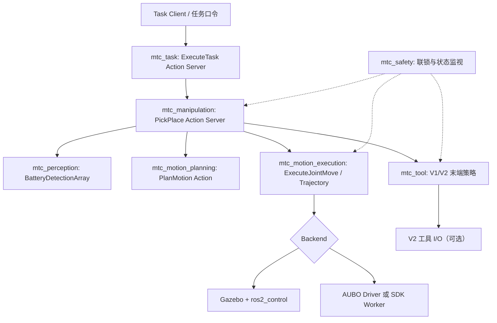
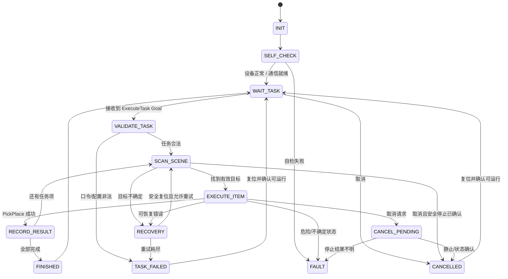
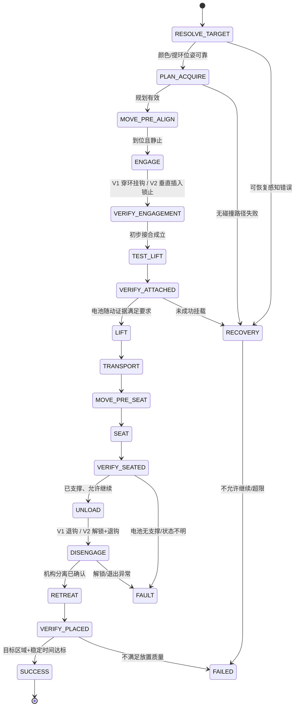
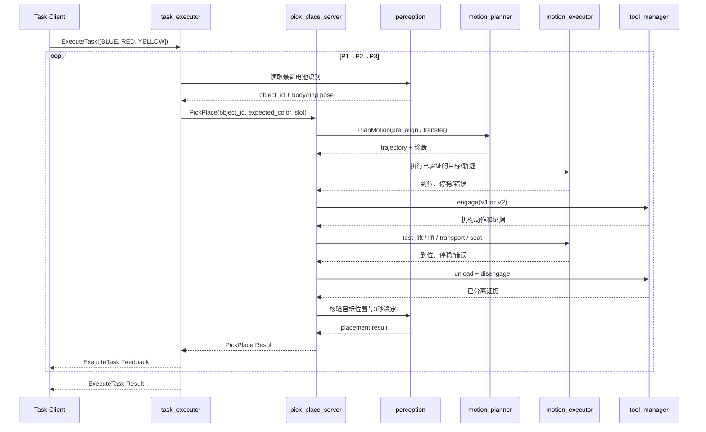

# AUBO S3 机械臂控制状态机与 ROS 2 接口技术设计

> 项目：美团第四届低空经济与具身智能挑战赛（初赛）  
> 文档版本：**V0.1 / 设计评审稿**  
> 日期：2026-10-09  
> 目标平台：Ubuntu 24.04 + ROS 2 Jazzy；AUBO S3；V1 被动舌规 / V2 机械锁止与电磁解锁  
> 推荐仓库位置：`meituan_challenge/docs/architecture/CONTROL_FSM_AND_ROS2_INTERFACES.md`  
> **重要：本文是拟定的接口契约，未声称接口已经实现、编译或在真实 S3 上通过测试。**

## 0. 摘要与决策

本文件的目标是先冻结比赛系统的**职责边界、状态机、接口语义和故障处理原则**，供感知、运动规划、机械控制、末端机构和仿真开发并行使用。

**本次建议确定的核心架构：**

1. 任务调度器 `mtc_task` 负责任务口令、T0/P1/P2/P3 顺序和任务进度。
2. 操作状态机 `mtc_manipulation` 负责一块电池从定位提环到最终验证的完整闭环。
3. `mtc_motion_planning` **沿用现有 `PlanMotion.action`** 负责规划，禁止把规划成功误判为执行成功。
4. `mtc_motion_execution` 负责执行、反馈、取消、停稳判断；仿真和真实机械臂接入同一个**上层执行契约**，底层能力不同必须显式区分。
5. `mtc_tool` 统一 V1/V2 接合与退出策略；V2 电磁解锁只属于工具策略内部动作。
6. `mtc_safety` 负责软件级联锁、故障上报和停止请求；**不替代控制柜安全功能或实体急停**。

**禁止的实现捷径：** 不得用循环发送 `moveJoint` 轨迹采样点伪装为已验证的实时轨迹控制；不得把“SDK 接受请求”当成“到位”；不得把“执行完穿环动作”直接当成“电池已挂载”；不得在未知负载/位置状态下无条件解锁或回 Home。

### 0.1 事实、设计提案与待确认项

| 分类 | 内容 | 状态 |
|---|---|---|
| 已有事实 | 实机交接记录：ARCS `0.25.6-alpha.1+c24e317c`、`pyaubo-sdk 0.24.1`、Python 3.10；RPC `30004`、RTDE `30010`；已验证一次 J6 目标运动 | **历史实测，仅该配置** |
| 已有事实 | 交接文档列出 ROS 2 工程 `mtc_interfaces`、`mtc_motion_planning`、`mtc_description`、`mtc_simulation` | **文档记录，尚未逐文件审计** |
| 已有事实 | 当前比赛示例在仿真中使用 Ground Truth，实机 SDK 链路尚未接通完整抓放流程 | **文档记录** |
| 已知机构 | V1 舌规侧向穿环、上提挂住、落座卸载后退钩；V2 从上方插入并机械锁止，解锁靠电磁铁，释放仍需卸载/退出 | **团队方案** |
| 设计提案 | 下文新增 Action、Topic、Service、FSM、错误码和命名空间 | **待团队评审后冻结** |
| 待确认 | S3 当前安装的实际 ROS 2 驱动、官方轨迹执行支持、装上 V1 的 TCP/质量/碰撞几何、V2 解锁电气参数 | **必须实测/标定** |

### 0.2 设计边界

**本期包含：** 固定底座单臂初赛；识别多色电池、选目标、提环取放、T0 和 P1/P2/P3 序列摆放、放置稳定性验证、日志与故障处理、Gazebo/实机统一上层接口。

**本期不包含：** 决赛移动底盘导航、全自动上电/解除保护停、V2 电磁驱动电路详细设计、机械接触力学已验证模型、视觉算法选型结论。预留未来扩展，但不为未确定功能增加复杂运行依赖。

## 1. 竞赛与硬件约束

### 1.1 比赛业务约束

- **基础任务：** 在初始区识别指定颜色电池，抓取并放置到 `T0`。
- **序列任务：** 按比赛口令排列三块目标电池，依次放置到 `P1 → P2 → P3`。任务配置驱动顺序，**不写死颜色**。
- **验证：** 确认电池主体进入目标判定区域，释放后稳定 **3 秒**；同时避免非目标电池被碰倒、抓错颜色和掉落。
- **自主执行：** 比赛演示开始后不得把人工交互用作正常任务状态转移。
- **时间：** 比赛规则包含总时长上限及时间评分；状态机必须支持任务级截止时间、单阶段超时和可度量日志。具体采用何种开始计时口径需按当轮赛事通知确认。

任务底图和规则来自项目所附《2026年挑战赛任务底图》《2026年挑战赛规则及赛题说明》《2026年挑战赛FAQ》。

### 1.2 电池/末端约束

- 目标电池具备可供挂载的顶部提环；V1 通过侧向穿环承载；V2 通过上方插入机械锁止后承载。
- 团队先前几何检查给出的提环名义开口约 `50 × 20 mm`、V1 钩头名义宽度约 `40 mm`；这些**只用于粗配合参考**，不代替实物装配、公差、碰撞/刚度验证。
- V1 不存在传统开闭夹爪；V2 电磁铁用于**释放/解锁**，不是依靠持续通电吸住电池。
- V1 与 V2 的 TCP、质量、重心、碰撞模型、进环及退钩轨迹应分别标定；所有软件动作使用工具局部坐标系描述。

### 1.3 实机当前技术基线

交接文档记录：NUC 为 Ubuntu 24.04，实机程序通过 Python 3.10 的 `pyaubo-sdk 0.24.1` 访问 ARCS。RPC 用于状态查询与 `moveJoint` 目标运动，RTDE 用于反馈订阅；历史测试请求 100 Hz，并非硬实时保证。实机已验证的是特定条件下 J6 关节目标动作，不是完整 `FollowJointTrajectory` 或笛卡尔伺服链路。

**本文件不抄录交接文档中的口令、Wi-Fi 密码及 SSH 凭据；配置用本地环境变量/受限文件管理，禁止提交仓库。**

## 2. 总体架构与 ROS 2 节点职责



| ROS 2 包 / 节点 | 单一职责 | 不应做的事 |
|---|---|---|
| `mtc_task/task_executor` | 任务验证、队列、进度、总时限、结果汇总 | 不直接调用 SDK、生成关节轨迹 |
| `mtc_manipulation/pick_place_server` | 单块电池抓放子状态机、调用感知/规划/执行/工具并判断结果 | 不自行实现颜色分割算法或底层电机控制 |
| `mtc_perception/battery_detector` | 颜色、物体位姿、提环位姿与置信度 | 不决定本轮抓取顺序 |
| `mtc_motion_planning/planner` | 沿用已有 `PlanMotion.action`、碰撞与约束规划 | 不直接启动硬件动作 |
| `mtc_motion_execution/motion_executor` | 接受受控运动请求、能力校验、执行、反馈、取消、停稳 | 不根据颜色识别更改任务 |
| `mtc_aubo_driver/aubo_adapter` | S3 SDK/驱动封装、RPC/RTDE 状态、唯一控制权 | 不执行比赛状态机 |
| `mtc_tool/tool_manager` | V1/V2 接合及释放运动原语与 V2 I/O | 不把解锁命令成功误当成完全释放 |
| `mtc_safety/safety_supervisor` | 监控健康、超时、模式、通信、停止请求和保护状态 | 不替代硬件急停 |
| `mtc_description` / `mtc_simulation` | URDF/TF/碰撞物体/测试环境 | 不把仿真真值包装成已验证的实机视觉 |

**控制命令所有权：** 同一时刻仅允许一个 motion executor 拥有运动命令执行权；Task 和 Manipulation Action 通过独立 `goal_id` 绑定，不允许手机点动或其他程序并发下发运动。软件进程锁不足以替代现场实际控制权检查。

## 3. 控制状态机

### 3.1 第一层：整轮 Task FSM



`SELF_CHECK` 仅检查已由现场人员安全启动的机器人状态，**不能自动解除急停、自动越过安全状态或在上电前发送运动指令**。`WAIT_TASK` 不意味着控制柜必须处于运动使能状态。

| 状态 | 进入条件 | 退出条件 / 输出 |
|---|---|---|
| `INIT` | 节点生命周期初始化 | 参数、TF、依赖服务存在 |
| `SELF_CHECK` | 初始化完成/复位 | 设备身份、运动模式、状态、工具配置、反馈时效通过 |
| `WAIT_TASK` | 准备就绪 | 受理任务 Goal；一次只能有一个进行中 Goal |
| `VALIDATE_TASK` | Goal 到达 | 模式、颜色数组长度、重复颜色、目标位等合法性校验 |
| `SCAN_SCENE` | 新任务项/需要重感知 | 当前目标颜色的唯一候选、空间位姿与可见提环合法 |
| `EXECUTE_ITEM` | 单项准备好 | 调用一次 `PickPlace`，记录其 Goal ID |
| `RECORD_RESULT` | 一项真实完成 | 更新 `completed_slots`，不依赖发令返回码 |
| `RECOVERY` | 允许重试的视觉/规划失败 | 重扫或重规划；不能对不确定在途运动盲重发 |
| `CANCEL_PENDING` | 取消活动任务 | 向子 Action 发取消，等停稳和负载状态确认 |
| `FINISHED` | 三个/一个目标全部完成 | 返回成功和最终状态快照 |
| `TASK_FAILED` | 业务终止，设备仍可安全恢复 | 返回原因，等待明确复位 |
| `FAULT` | 危险、通信或运动状态不确定 | 停止请求、锁定新的动作并等待人工排查 |

**任务顺序约定：** `MODE_BASIC`：`ordered_colors` 必须 1 个，目标 `T0`。`MODE_SEQUENCE`：必须 3 个互异有效颜色，目标按数组次序固定映射 `P1/P2/P3`。这是本设计的约定，应与赛事口令解析模块一致。

### 3.2 第二层：单块 PickPlace FSM



| 阶段 | 必须观察或检查的事件 | 建议的实现边界 |
|---|---|---|
| `RESOLVE_TARGET` | 目标颜色唯一、位姿足够新、提环位姿合法 | `mtc_perception` + TF |
| `PLAN_ACQUIRE` | 用对应工具几何、接触允许集规划；记录规划结果 | `PlanMotion.action` |
| `MOVE_PRE_ALIGN` | 移动到安全预对准位，实际到位且停稳 | `motion_executor` |
| `ENGAGE` | V1 横向进环后挂钩；V2 上方插入后锁止 | `tool_manager` 输出**局部运动原语** |
| `VERIFY_ENGAGEMENT` | 轨迹结果正常，机构姿态合理；有 DI 时核对锁止信号 | **不等于已成功抓取** |
| `TEST_LIFT` | 短距离、低速试提，观察是否随动 | 运动执行 + 视觉/可用传感器 |
| `VERIFY_ATTACHED` | 电池随动、未脱钩，证据级别符合当前测试模式 | 决定是否进入运输 |
| `LIFT / TRANSPORT` | 附着物体更新后按限速轨迹搬运 | 规划场景 + motion executor |
| `SEAT` | 电池主体在目标位置获得台面承托，不得继续硬顶 | 受约束低速下降 |
| `VERIFY_SEATED` | 确认支撑、位置及工具允许的卸载方向 | 未通过禁止释放 |
| `UNLOAD` | 舌规/锁扣不再承担主要电池重量 | 局部位移（待实测公差） |
| `DISENGAGE` | V1 按退钩方向撤出；V2 先触发电磁解锁再按工具几何撤离 | 工具策略；动作失败进入保守故障 |
| `RETREAT` | 工具从提环/电池和目标区净空撤离 | 碰撞安全轨迹 |
| `VERIFY_PLACED` | 视觉定位 + 目标框判定 + **连续稳定 3 秒** | 独立于 SDK 运动完成判断 |

V1/V2 共用上层 `PickPlace`，仅 **`ENGAGE`、`VERIFY_ENGAGEMENT`、`DISENGAGE`** 内部不同。若 V2 解锁失败，**禁止继续强行抽出或直接上抬**。

### 3.3 设备运行状态与任务状态分离

额外发布设备状态：`DISCONNECTED`、`NOT_READY`、`READY`、`MOVING`、`STOP_REQUESTED`、`STOPPED`、`FAULT`。设备 `READY` 不代表 `PickPlace` 成功；设备 `STOPPED` 也不代表任务安全可重试。切换真实/仿真后必须重新执行设备准备检查。

## 4. ROS 2 通信设计

### 4.1 使用原则

- **Topic：** 高频或持续状态；传感器、关节反馈、任务快照、工具状态。
- **Service：** 可在短时间内完成的查询/触发，如读取能力、V2 解锁脉冲的低层操作；**Service 返回 accepted 不代表物理动作已完成**。
- **Action：** 可取消、有进度反馈的耗时操作：整轮任务、单块电池操作、规划、运动执行。
- **坐标单位：** 位姿用米与四元数、关节用弧度、时间用秒/毫秒（逐字段写明）、颜色用稳定的数值枚举。
- **命名：** 新建业务接口统一前缀 `/mtc/`；标准 `/joint_states`、`/tf` 保持 ROS 常规名称，具体控制器 Action 可经适配层映射。
- **接口版本：** 对已发布 `.msg/.srv/.action` 采取追加兼容字段优先策略；不兼容更改必须升级接口版本并更新消费者。

### 4.2 接口总表（V0.1 提案）

| 名称 | 类型 | 消息/服务 | 提供方 → 使用方 |
|---|---|---|---|
| `/mtc/task/execute` | Action | `ExecuteTask.action` | task_executor ← 比赛启动程序 |
| `/mtc/task/state` | Topic | `TaskState.msg` | task_executor → UI/日志 |
| `/mtc/manipulation/pick_place` | Action | `PickPlace.action` | pick_place_server ← task_executor |
| `/mtc/perception/batteries` | Topic | `BatteryDetectionArray.msg` | perception → task/manipulation |
| `/mtc/motion/plan` | Action | **现有** `PlanMotion.action` | planner ← manipulation |
| `/mtc/motion/execute_joint_move` | Action | **新增** `ExecuteJointMove.action` | motion_executor ← manipulation |
| `/mtc/motion/execute_trajectory` | Action | `ExecuteTrajectory.action`（**阶段二候选**） | motion_executor ← manipulation |
| `/mtc/motion/capabilities` | Service | `GetMotionCapabilities.srv` | motion_executor ← bringup/规划器 |
| `/mtc/tool/state` | Topic | `ToolState.msg` | tool_manager → FSM/日志 |
| `/mtc/tool/trigger_unlock` | Service | `TriggerUnlock.srv`（仅 V2 内部） | tool_manager ↔ I/O 适配层 |
| `/mtc/robot/state` | Topic | `RobotState.msg` | aubo_adapter → safety/FSM |
| `/mtc/safety/stop_motion` | Service | `RequestStop.srv`（软件停止请求） | safety → motion_executor |
| `/joint_states` / `/tf` / `/tf_static` | Topic | ROS 2 标准 | 驱动/robot_state_publisher → 系统 |

**迁移说明：** `PlanMotion.action` 与交接工程已有 `Latch.srv` 的真实字段尚未获得源文件，本文件**不擅自重定义这两个已存在类型**。此处新接口为拟新增的契约，需在代码审计时核对冲突；`Latch.srv` 可保留为仿真/历史兼容层，再逐步迁移到工具策略。

### 4.3 `ExecuteTask.action`（拟新增）

文件：`mtc_interfaces/action/ExecuteTask.action`

```text
# Goal
uint8 MODE_BASIC=1
uint8 MODE_SEQUENCE=2
string task_id
uint8 mode
uint8[] ordered_colors
uint32 timeout_ms
---
# Result
bool success
uint8 completed_count
string[] completed_slots
uint16 error_code
string message
---
# Feedback
uint8 current_index
uint8 total_count
string state
string current_slot
string current_object_id
```

**校验：** `task_id` 本轮唯一；`timeout_ms > 0`；基本任务 `ordered_colors` 恰好 1 项；序列任务恰好 3 项且互不重复；所有颜色属于已知合法集合。客户端取消触发 `CANCEL_PENDING`，不可无等待地返回 `CANCELED`。

### 4.4 `PickPlace.action`（拟新增）

文件：`mtc_interfaces/action/PickPlace.action`

```text
# Goal
string request_id
string object_id
uint8 expected_color
string target_slot
---
# Result
bool success
bool placement_verified
uint16 error_code
string message
---
# Feedback
string substate
float32 progress
bool object_attached_estimated
string detail
```

**字段约定：** `object_id` 在任务执行前由感知选择出的唯一目标给出，不能在执行过程中无提示地切换到另一个对象；`expected_color` 是防抓错的双重校验；`target_slot` 仅允许 `T0/P1/P2/P3`。`placement_verified=true` 必须在 `VERIFY_PLACED` 通过后才允许出现。

### 4.5 `BatteryDetection.msg` / `BatteryDetectionArray.msg`（拟新增）

文件：`mtc_interfaces/msg/BatteryDetection.msg`

```text
uint8 COLOR_UNKNOWN=0
uint8 COLOR_RED=1
uint8 COLOR_BLUE=2
uint8 COLOR_YELLOW=3
uint8 COLOR_GREEN=4
string object_id
uint8 color
geometry_msgs/PoseStamped body_pose
geometry_msgs/PoseStamped ring_pose
float32 confidence
bool ring_pose_valid
```

文件：`mtc_interfaces/msg/BatteryDetectionArray.msg`

```text
std_msgs/Header header
BatteryDetection[] detections
```

`body_pose` 约定为电池主体中心；`ring_pose` 约定为**提环局部抓取参考坐标系**，其轴向必须在 `TF_CONVENTIONS.md` 中详细定义。`ring_pose_valid=false` 时不得使用未定义 pose。每条 `PoseStamped.header.frame_id` 必须可转换到 `base_link`；变换超时/数据过期时拒绝生成运动目标。

### 4.6 `ToolState.msg`（拟新增）

文件：`mtc_interfaces/msg/ToolState.msg`

```text
std_msgs/Header header
uint8 STATE_UNKNOWN=0
uint8 STATE_DETACHED=1
uint8 STATE_ENGAGING=2
uint8 STATE_ATTACHED=3
uint8 STATE_RELEASING=4
uint8 STATE_FAULT=5
uint8 EVIDENCE_NONE=0
uint8 EVIDENCE_COMMAND_ONLY=1
uint8 EVIDENCE_GEOMETRY=2
uint8 EVIDENCE_SENSOR_OR_VISION=3
uint8 state
uint8 evidence_level
bool verified
string tool_type
string object_id
string detail
```

**强约束：** `STATE_ATTACHED` 是当前估计，`verified` 是另一个维度；V1 不能把运动命令结束当作独立抓取证据。V2 若只有电磁铁输出信号也不能证明机构已经解锁。日志保留证据来源。

### 4.7 `TaskState.msg` / `RobotState.msg`（拟新增）

文件：`mtc_interfaces/msg/TaskState.msg`

```text
std_msgs/Header header
string task_id
string state
string substate
uint8 completed_count
uint8 total_count
uint16 last_error_code
string detail
```

文件：`mtc_interfaces/msg/RobotState.msg`

```text
std_msgs/Header header
bool communication_ok
bool robot_ready
bool motion_active
bool safety_normal
bool stop_confirmed
bool simulation_mode
string controller_mode
string detail
```

`RobotState` 是适配层规约后的信息；底层 SDK 的原始状态码须另写日志，不能通过简单布尔值丢弃关键安全原因。

### 4.8 `ExecuteJointMove.action`（拟新增，MVP）

文件：`mtc_interfaces/action/ExecuteJointMove.action`

```text
# Goal
string command_id
string[6] joint_names
float64[6] target_rad
float32 velocity_scaling
float32 acceleration_scaling
uint32 timeout_ms
---
# Result
bool success
bool stop_confirmed
float64[6] final_position_rad
uint16 error_code
string message
---
# Feedback
float64[6] actual_position_rad
float64[6] actual_velocity_rad_s
float32 progress
string execution_state
```

此接口专门适配“给定六关节目标并验证真实到位”的能力；不承诺中间点逐点时间同步。`velocity_scaling / acceleration_scaling` 应当相对于**已审核的每种运动原语上限**解释，不能直接无界映射到机械臂厂商的绝对速度；具体数值换算由运动执行配置负责。**`joint_names` 必须与 `target_rad` 按索引一一对应，执行层逐项对照实际 URDF 和驱动关节列表，不得靠固定 J1～J6 顺序猜测。**

**阶段二：** 仅在确定驱动支持并实测跟踪带时间戳轨迹后，再启用 `ExecuteTrajectory.action` 或直接使用标准 `control_msgs/action/FollowJointTrajectory`。两条后端的能力通过 `GetMotionCapabilities` 显式声明；上层不得静默把轨迹重新解释为若干 `moveJoint`。

### 4.9 `GetMotionCapabilities.srv`（拟新增）

文件：`mtc_interfaces/srv/GetMotionCapabilities.srv`

```text
---
bool joint_goal_supported
bool timed_trajectory_supported
bool cartesian_motion_supported
bool cancel_supported
string backend_name
string detail
```

**解释：** capability 是**当前连接且经实测启用**的控制通路能力；不能仅因为 SDK 声称存在某个方法就设置 `true`。

### 4.10 `TriggerUnlock.srv` / `RequestStop.srv`（拟新增）

文件：`mtc_interfaces/srv/TriggerUnlock.srv`

```text
# 仅由 tool_manager 在 VERIFY_SEATED + UNLOAD 后调用
string request_id
uint32 pulse_ms
---
bool accepted
string message
```

`TriggerUnlock` 只表示发送解锁脉冲请求，**不宣称电池已经释放**；V2 的 `DISENGAGE` 必须等待反馈/观察并执行退出路径。具体 DO 通道、供电、保护电路、脉冲长度均待电气实测。

文件：`mtc_interfaces/srv/RequestStop.srv`

```text
string reason
---
bool request_delivered
string message
```

`request_delivered=true` 仅表示停止请求成功送达执行适配层；**必须结合 RTDE/机器人状态确认静止、队列为空、控制状态正常，才能设置 `stop_confirmed=true`**。此接口不是紧急停止，也不保证网络失效时能够使机械臂停下。

### 4.11 Topic QoS 设计建议

| Topic | 可靠性 / 历史 | 原因 |
|---|---|---|
| `/joint_states` | 沿用驱动发布者 QoS；订阅侧保持兼容 | 不在未知驱动下擅自改 QoS |
| `/mtc/perception/batteries` | `RELIABLE`、`KEEP_LAST(5)`；新帧覆盖旧帧 | 电池目标更新较慢，要求数据可追踪；必须配合时间戳过滤 |
| `/mtc/task/state` | `RELIABLE`、`KEEP_LAST(10)` | 任务状态可供日志/UI 使用 |
| `/mtc/tool/state` | `RELIABLE`、`KEEP_LAST(10)` | 机构状态变化不可悄然丢失；重建连接后主动重发当前状态 |
| `/mtc/robot/state` | `RELIABLE`、`KEEP_LAST(10)` | 软件层监测需要完整的状态提示，安全不能只靠此 Topic |

QoS 属于初稿，必须通过实机 DDS 通信及负载测试确认；**不能依赖 ROS Topic 延迟作为硬件安全保障**。

## 5. 末端策略和几何/坐标约定

### 5.1 工具策略接口（逻辑契约）

```cpp
// 设计示意，非直接可编译的当前工程源码。
struct MotionPrimitive {
    std::string name;
    geometry_msgs::msg::PoseStamped target;
    double max_linear_speed_m_s;
    double max_angular_speed_rad_s;
    bool requires_contact;
};

class ToolStrategy {
public:
    virtual ~ToolStrategy() = default;
    virtual ToolType type() const = 0;
    virtual std::vector<MotionPrimitive> makeAcquirePlan(const RingPose&) = 0;
    virtual std::vector<MotionPrimitive> makeReleasePlan(const SeatPose&) = 0;
    virtual bool requiresUnlockPulse() const = 0;
};
```

真正代码中可将规划/执行拆成多个异步 Action，`ToolStrategy` 本身**不直接掌控底层关节控制权**。工具只产生有约束的运动原语和机构事件；执行由 `motion_executor` 掌控。

### 5.2 两代动作矩阵

| 统一阶段 | V1 被动舌规 | V2 锁止 + 电磁铁 |
|---|---|---|
| 预对准 `PRE_ALIGN` | 提环开口侧面的进环准备位 | 提环上方对中位 |
| 接合 `ENGAGE` | 横向穿环，适当上提完成挂钩 | 从上方下降插入，触发机械锁止 |
| 验证 `TEST_LIFT` | 低速短距试提，观察随动 | 同样试提；可叠加锁止开关反馈 |
| 搬运 `TRANSPORT` | 维持提环方向/工具姿态 | 保持机械锁止，不需要持续吸持通电 |
| 落座 `SEAT` | 目标位上方下降至有承托 | 同上 |
| 卸载 `UNLOAD` | 小幅调整使倒钩不承重 | 小幅调整让锁扣不承重 |
| 分离 `DISENGAGE` | 沿标定的反向路径退出 | 解锁脉冲、确认解锁，按 V2 标定路径退出 |
| 撤离 `RETREAT` | 净空后离开 | 净空后离开 |

**不得假设 V2 必定能垂直向上退出**：它是上方插入，但实际解锁后的干涉、退出方向须由 V2 CAD 装配与实物测试确定。

### 5.3 TF / TCP 最小约定

```text
world（选用全局参考）
├── base_link
│   └── ... ── tool0
│                 └── hook_tcp   # V1/V2 分别标定
├── table_frame
│   ├── T0_frame
│   ├── P1_frame
│   ├── P2_frame
│   └── P3_frame
└── battery_<id>_frame [动态/观测]
    └── ring_frame           # 相对本体固定的标定定义

camera_link 按真实安装位置挂到机器人/外参树中；
如果是腕部相机，不能误挂在 world 的静态分支下。
```

静态工位目标来源于底图尺寸和桌面实际标定；电池实时位姿必须由感知返回。对于带提环的电池，规划应针对 `ring_frame` 而不是主体几何中心。接合成功后，规划场景将电池表示为附着碰撞体；在可靠验证接合前不能盲目 attach。释放和分离完成后更新 planning scene，禁止在附着模型仍存在时规划不合理的撤离路线。

### 5.4 低速接触动作与规划能力

自由空间移动可用已验证的轨迹规划；进环、卸载、退钩等接触敏感阶段必须使用**连续、可控且经过实际验证的局部运动方式**。若当前只有关节目标运动能力，在笛卡尔局部路径的动态执行支持被验证前，不得直接上实机执行未验证的多点轨迹。可先在 Gazebo 验证几何，再用低速短程的受监护实验逐步确认控制能力。

## 6. AUBO S3 运动执行适配层

### 6.1 现有基线与技术风险

交接文档中的实机链：`RPC → moveJoint/stopJoint`，`RTDE → q/qd/target_q/target_qd`。该链证明目标运动及反馈可用，但**不能推出**支持完整的 ROS 2 时间参数化轨迹。现有 `PlanMotion.action` 返回的轨迹需经执行适配层验证后再交给实机。

| 控制能力 | 当前证据 | 迁移策略 |
|---|---|---|
| 只读连接、身份/安全状态读取 | 有历史记录 | 直接保留并封装为适配层 |
| 单组六关节目标移动 | 有 J6 历史实测 | 先封装为 `ExecuteJointMove`，逐步测全部关节 |
| 监测 RTDE 运动反馈 | 有历史记录 | 迁移为通用监测器，参数重新标定 |
| 完整时间轨迹跟踪 | 未见该机型实机验证 | 禁止默认启用，先核实 driver/SDK |
| 受约束笛卡尔进环/退钩 | 未见实机验证 | 单独试验并明确支持模式 |
| 末端 V2 I/O 与锁止反馈 | 未见实机验证 | 电气和软件联调后再发布能力 |

### 6.2 SDK 与 ROS 2 Python 运行环境

若保持现有 `pyaubo-sdk` Python 3.10 环境，Jazzy 系统 Python 通常为 3.12，**不能默认用同一 Python 进程直接混装 SDK 和 rclpy**。两条可选技术路线：

- **路线 A（优先评估）：** 若确认存在与当前 ARCS/S3 兼容且通过实机验证的 ROS 2 Driver，使用原生驱动对接标准控制器。
- **路线 B（过渡可行）：** 将现有 Python 3.10 SDK 封装成独立 Worker；ROS 2 Jazzy Bridge 通过 Unix Domain Socket/IPC 与其通信。此桥接必须有请求 ID、互斥执行、状态超时、停止请求、掉线不自动重发等机制。

**路线是否采用，由一次小范围能力验证后决定，而非仅依据 GitHub/SDK 文档宣称。**

### 6.3 命令执行的七步握手

1. **PREPARE：** 验证机器人身份、真机/仿真模式、工具 TCP/负载、运动限制、无并发命令及初始关节状态。
2. **ACCEPT：** 按 `command_id` 获得唯一执行权；拒绝重复的在途命令。
3. **VALIDATE：** 验证轨迹/目标合法、与最新关节位置匹配、规划场景/工具版本一致。
4. **SEND：** 向所选底层接口发送一次命令；记录发令意图与返回。
5. **MONITOR：** 观察反馈时效、实际关节/速度、控制状态、跟随偏差及超时。
6. **CONFIRM：** 同时达到允许位置误差、持续静止、执行队列/运动状态清空要求，才返回 `success=true`。
7. **STOP/FAULT：** 如果超时/取消/反馈异常，请求底层停止并判断是否真正停稳；送达不明则故障锁定，禁止自动补发。

不能把旧 J6 测试的速度、位置、误差阈值直接应用于所有关节、所有载荷和工具。配置须按 V1/V2、运动阶段、实际负载分别标定；初始默认应保守并禁止未验收的高速动作。

### 6.4 停止与不确定状态处理

- `Action Cancel`：先进入 `CANCEL_PENDING`，停止请求后等待真实状态确认；确认之前不得返回已安全停止。
- 底层断线时：标记 `MOTION_STATUS_UNKNOWN`，锁住新的动作；不因为“收不到成功响应”而重复发送原目标。
- 正携带电池时：禁止自动解锁/掉落、无条件 Home 或原路返回；由故障处理确定安全停放策略。
- ROS 2 节点崩溃：SDK Worker 需有独立监护与互斥控制规则；**远程进程结束、拔线或 `Ctrl+C` 都不等价于实体急停**。

## 7. 故障分类、恢复与安全联锁

### 7.1 错误码表（`uint16`，建议冻结）

| 代码 | 常量（建议） | 含义 | 默认处置 |
|---|---|---|---|
| `0` | `OK` | 完成且验证通过 | 成功 |
| `100` | `INVALID_TASK` | 任务模式/颜色/工位非法 | 拒绝任务 |
| `110` | `TARGET_NOT_FOUND` | 未找到或颜色不唯一 | 重新感知；限次 |
| `120` | `POSE_STALE` | 视觉/TF 数据过期或坐标不可转换 | 等待新帧；限次 |
| `200` | `PLANNING_FAILED` | IK/碰撞/轨迹约束不满足 | 重新规划；限次 |
| `210` | `EXECUTION_REJECTED` | 目标不合法/后端能力不支持 | 拒绝并诊断 |
| `220` | `MOTION_TIMEOUT` | 指令后超时 | 停止请求，检查状态 |
| `230` | `MOTION_STATUS_UNKNOWN` | 反馈断流/请求结果不确定 | 锁定动作，人工核验 |
| `300` | `ENGAGE_FAILED` | 穿环或锁止未完成 | 无载荷前提下退回重试 |
| `310` | `ATTACH_NOT_VERIFIED` | 试提后缺少挂载证据 | 不得运输 |
| `320` | `OBJECT_DROPPED` | 电池掉落 | 立即中止本项并重感知，不盲目继续 |
| `400` | `SEAT_NOT_VERIFIED` | 未确认电池由桌面承载 | 禁止释放 |
| `410` | `UNLOCK_FAILED` | V2 解锁失败或状态未知 | 不强制拔出；故障 |
| `420` | `RELEASE_NOT_VERIFIED` | 退钩/释放结果未知 | 故障，阻止撤离碰撞 |
| `430` | `PLACEMENT_FAILED` | 未落到判定区或稳定性失败 | 记录失败/条件允许时重试 |
| `500` | `SAFETY_INTERLOCK` | 安全状态不满足 | 禁止运动 |
| `510` | `HARDWARE_FAULT` | 控制柜、关节或工具故障 | 终止任务 |
| `520` | `CANCEL_NOT_CONFIRMED` | 取消后未确认停稳 | 故障锁定 |

**重复策略：** 对感知/纯规划失败可配置最多重试次数；一旦存在“是否已执行运动”或“是否仍携带电池”不确定，禁止自动重发。自动重试必须在明确安全可重试且世界状态被重新观测的前提下进行。

### 7.2 关键联锁（必须在单元测试体现）

| 当前条件 | 禁止行为 |
|---|---|
| 机械臂未 READY、处于仿真/真机模式不符、状态过期 | 任何实机运动 |
| 未验证挂载 | 进入正常运输阶段 |
| 电池尚未安全落座 | V2 发送电磁解锁脉冲 |
| 解锁/脱离状态不确定 | 水平硬拉、直接上抬、下一个任务项 |
| 正在执行运动 | 第二个运动 Goal / 另一客户端抢占 |
| 机器人/工具 TCP 或负载更改 | 沿用旧计划而不重新校验 |
| 取消或 SDK 断线后未确认停稳 | 返回成功、启动下一目标、自动 Home |

## 8. 参数与配置约定（示意，非已经标定）

```yaml
# config/manipulation.yaml — 推荐结构，数值在联调/标定后填写
mtc_manipulation:
  ros__parameters:
    tool_type: "passive_hook_v1"  # 或 magnetic_latch_v2
    target_slots: ["T0", "P1", "P2", "P3"]
    verify_test_lift: true
    verify_placement: true
    placement_stability_sec: 3.0
    perception_max_age_sec: 0.3     # 初始建议值，待实测
    recovery_max_attempts: 1        # 仅安全可恢复的错误
    motion_backend: "capability_checked"

# 单独工具配置，必须经实机标定，不以示意数值驱动真实机械臂
# tool_v1.yaml: side_insert / hook_lift / unload / withdraw
# tool_v2.yaml: top_insert / verify_lock / unload / pulse_unlock / withdraw
# motion_profiles.yaml: 各阶段速度、加速度、距离、timeout、停稳容差
# safety.yaml: 通信/状态超时、警戒参数、机器人身份白名单
```

**不要将真实密码放入 YAML。** `mtc_bringup` 负责按 `sim/real` 和 `tool_v1/tool_v2` 组合加载参数，并记录所用配置版本和哈希。

## 9. 时序示例：蓝—红—黄任务



此图省略各阶段单独规划请求和工具内部运动调用，不意味着 `tool_manager` 有权绕过运动执行层直接发关节命令。

## 10. 推荐开发计划与验收标准

| 阶段 | 交付物 | 验收标准（必须记录证据） |
|---|---|---|
| P0 接口评审 | 本文评审通过、IDL 名称固定、`PlanMotion` 实际字段对齐 | 组内完成接口签字；修改记录清晰 |
| P1 AUBO 只读适配 | 机器人身份、关节状态、模式、告警接入 ROS 2 | ROS 2 与原 SDK 读数在合理时差下可对照，异常状态阻止执行 |
| P2 单关节目标 Action | `ExecuteJointMove` + 唯一执行权 + 取消/停稳检测 | 低风险测试姿态小运动，超时/重复发令/通信中断用离线与受控实测验证 |
| P3 V1 无视觉取放 | 固定标定位姿的 `PickPlace` | 提环接合、试提、落座、卸载、退钩完整闭环；不碰非目标物 |
| P4 感知与 TF | 电池颜色和环位姿 + 新鲜度/唯一性判断 | 不依赖仿真 Ground Truth 即可定位、过滤低置信结果 |
| P5 任务 FSM | `ExecuteTask` 基础 + 3 位序列 | 不改硬编码即可执行不同合法口令；正确记录 T0/P1/P2/P3 结果 |
| P6 V2 接入 | 机械锁止、解锁联锁、I/O 证据 | 落座之前不解锁，异常解锁不强行退出 |
| P7 回归测试 | 仿真/真机两套日志、测试报告、比赛视频流程 | 断线、取消、抓取失败、掉落等路径均有确定结论或明确未知状态 |

### 10.1 必测故障用例

- 同一时刻提交两个 Task Goal 或 Motion Goal → 第二个明确拒绝。
- 视觉识别目标颜色错误/重复 ID/提环位姿过期 → 不运动。
- 规划成功但底层执行失败 → 任务不得标记成功。
- `moveJoint` 请求超时但机器人可能在动 → 不自动重发。
- 试提时电池未跟随 → 禁止进入运输。
- 放置时未落座 → V2 电磁解锁不得触发。
- V2 解锁请求已接受但锁止状态未解除 → 不撤离。
- 取消正在搬运的 Action → 进入不确定负载保护逻辑，停止后保留状态。
- 机械臂模型、TCP、负载或控制器模式变化 → 旧规划作废。
- 非目标电池进入工具扫掠区域 → 规划/执行拒绝。

### 10.2 日志与回放字段

每个任务/单项/运动命令必须携带可关联的 `task_id`、`request_id`、`command_id`；记录 `goal_accepted`、`plan_generated`、`command_intent`、`sdk_response`、`feedback`、`stop_requested`、`stop_confirmed`、`tool_state_changed`、`placement_verified`、`result`。同时记录 ROS 时间、进程单调时间、所用设备身份、工具型号、TF 标定版本和参数哈希。**录屏/仿真 Ground Truth 只作为调试证据，不能替代实机任务完成验证。**

## 11. 既有工程迁移对照

| 旧位置/内容 | 处理建议 | 迁移限制 |
|---|---|---|
| `mtc_motion_planning/src/planner.cpp` | **保留优先，审计后复用** | 现有接口不得默默换字段含义；规划不等于执行 |
| `mtc_motion_planning/include/.../trajectory.hpp` | 保留算法与验证测试 | 重新验证与真实控制器执行能力匹配 |
| `mtc_interfaces/action/PlanMotion.action` | **保留已有契约** | 评审 actual IDL 后决定是否补版本字段 |
| `mtc_interfaces/srv/Latch.srv` | 保留历史/仿真适配；设计工具层兼容入口 | 不能把 V1 纯机械末端当成可开关锁扣 |
| `mtc_description/urdf/s3_latch.urdf` | 拆工具配置：S3+V1 / S3+V2 | 需要真实 TCP、惯性、碰撞网格标定 |
| `mtc_simulation/src/simulation_system.cpp` | 保留仿真测试和物体接触验证 | Ground Truth 不能伪装为真实感知 |
| `scripts/demo.py` | 抽出逻辑，逐步让位给 `mtc_task` + `mtc_manipulation` | 旧演示作为回归基线保留 |
| `hardware/smoke.py` | 抽出 SDK 连接、状态查询和日志能力 | 去除特定历史动作耦合，避免直接驱动新项目 |
| `hardware/telemetry.py` | 封装 RTDE Reader | 重新定义实际时效/容差与断线策略 |
| `j6_45*.py` / `verify_final.py` | 冻结归档与保留历史证明 | **不再作为比赛运动执行器扩展** |

## 12. 当前待决问题（在代码冻结前逐项确认）

1. **实机轨迹能力：** 当前 S3/ARCS 版本是否能稳定执行带时间戳的整条 ROS 2 `JointTrajectory`？如不能，局部笛卡尔运动允许采用哪种经验证的控制接口？
2. **工具实际参数：** V1/V2 法兰安装姿态、TCP、质量、重心、工具碰撞模型、提环允许接合方向、退钩净空与容差。
3. **V2 电磁输出：** 数字 I/O 路径、电流/电压要求、脉冲时长、解锁反馈来源、断电保持策略、互锁传感器。
4. **视觉位置关系：** 真实 D435i 是否已经装在腕部、实际 RGB-D 标定结果、`ring_frame` 姿态定义与更新率。
5. **控制权：** 手机示教器、NUC 自动控制和可能的其他客户端如何明确互斥；不允许软件默认获得“独占控制”。
6. **现有 IDL/控制器源码：** 拿到 `PlanMotion.action`、`Latch.srv`、`planner.cpp`、仿真控制器真实代码后进行接口对照，不在缺乏代码时臆测实现细节。
7. **验收阈值：** 运动速度、停稳、视觉置信度、最大重试次数、接触行程必须由受控实测确定，不能照搬 J6 历史测试数值。

## 13. 版本与评审结论

- **V0.1 / 2026-10-09：** 根据赛题、V1/V2 末端结构方案及 `AUBO_S3.md` 交接记录，首次提出可供团队评审的 FSM 和 ROS 2 接口框架。
- 下一次版本应在拿到实际仓库源码、确定 AUBO 控制后端和确认工具几何标定后升级为 **V0.2（接口冻结版）**。
- 当前 `ExecuteTask`、`PickPlace`、`ExecuteJointMove` 和自定义 Message 定义为**拟新增、待编译验证**；不得据此宣称已经接通实机。

### 参考输入材料

1. 项目附件：《2026年挑战赛规则及赛题说明》、 《2026年挑战赛任务底图》、 《2026年挑战赛FAQ》（2026-07-22 版本）。
2. 同学交接文档：《AUBO S3 使用与控制手册：手机操作、NUC 连接与程序控制》，编写日期 2026-10-02；其历史实测日期为 2026-09-30。
3. 团队提供的 `舌规V1.STEP`、`电池道具(1).stp`；用户确认 V1 提环抓取与 V2 上方插入锁止、通过电磁铁释放的机构方案。
4. ROS 2 Jazzy 的标准通信模型（Topic/Service/Action）、`sensor_msgs/JointState`、`trajectory_msgs/JointTrajectory`、`control_msgs/FollowJointTrajectory`、`tf2` 作为通用实现概念；是否能直接用于当前 S3 实机需要独立确认。
