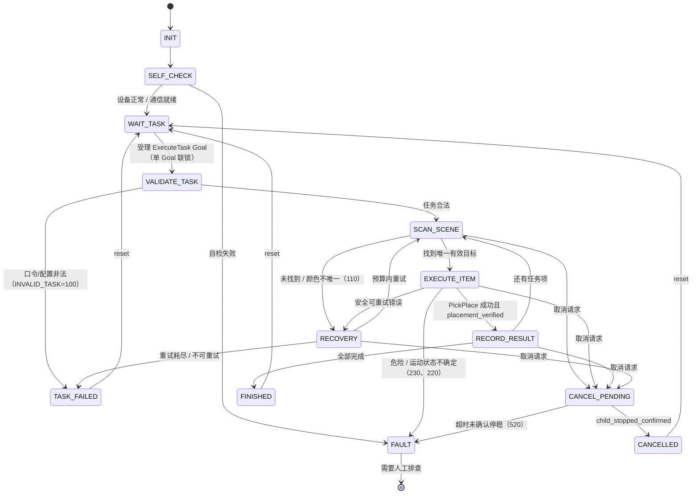

# mtc_task —— 整轮比赛任务状态机（第一层 Task FSM）

> **状态：Mock / 离线实现，未在 ROS 2 Jazzy 上编译验证。**
> 本机只有 ROS 2 Humble（`ROS_DISTRO=humble`），按交付约定**未执行 `colcon build`**。
> 本包不连接、不驱动真实 AUBO S3；运行本节点不等于获得实机操作授权。

## 1. 包职责

| 项 | 内容 |
|---|---|
| Action Server | `/mtc/task/execute`（`mtc_interfaces/action/ExecuteTask`） |
| Action Client | `/mtc/manipulation/pick_place`（`mtc_interfaces/action/PickPlace`） |
| 状态话题 | `/mtc/task/state`（`mtc_interfaces/msg/TaskState`），QoS **RELIABLE + KEEP_LAST(10)** |
| 核心逻辑 | `mtc_task/task_fsm.py`（**不依赖 rclpy**）、`mtc_task/task_validation.py` |
| ROS 外壳 | `mtc_task/task_executor.py`（薄外壳，可依赖注入 fake） |

职责边界：本包只负责**整轮任务级**的受理、校验、排序、取消、恢复与故障锁定；
单块电池的抓放流程属于第二层 `PickPlace` FSM（`mtc_manipulation`），本包只调用其 Action。

设计依据：`docs/architecture/AUBO_S3_ROS2_状态机与接口技术设计_v0.1.md`
§3.1（状态表）、§4.3（`ExecuteTask` 校验）、§7（错误码与联锁）、§9（时序示例）。

## 2. 状态图



转移实现方式：全部集中声明在 `task_fsm.py` 的 `TRANSITIONS` 表
（`(state, event) -> (next_state, guard, fallback, else_state)`），
进入状态的处理集中在 `ENTRY_ACTIONS` 表（`state -> _enter_xxx`）。
**没有任何状态转移散落在业务 if/else 中**，导入期由 `_self_check_tables()` 校验两张表与枚举一致。

## 3. 事件表

| 事件 | 触发来源 | 语义 |
|---|---|---|
| `self_check_ok` | 外壳 | 初始化完成 / 自检通过 |
| `self_check_fail` | 外壳 | 初始化或自检失败 → FAULT |
| `goal_accepted` | Action Server `execute_callback` | 受理新 Goal；活跃状态下必被拒绝 |
| `goal_rejected` | 上层 | 已受理 Goal 被撤回 |
| `task_validated` | 本包校验 | 模式/数量/颜色/工位/超时全部合法 |
| `task_validation_failed` | 本包校验 | 非法口令 → TASK_FAILED(100) |
| `target_found` | 感知回调 | 唯一候选且 `ring_pose_valid` |
| `target_not_found` | 感知回调 | 未找到或颜色不唯一 → RECOVERY |
| `scan_failed` | 感知回调 | 明确无法恢复 → TASK_FAILED |
| `item_succeeded` | PickPlace Result | 成功且 `placement_verified=true` |
| `item_failed` | PickPlace Result | 失败，由守卫判定是否可重试 |
| `item_unsafe` | PickPlace Result | 危险/不确定（230、220、510…）→ FAULT |
| `retry_approved` / `retry_denied` | 恢复策略 | 消耗或拒绝重试预算 |
| `record_ok` / `record_failed` | 记录结果 | 登记真实完成项（不依赖发令返回码） |
| `cancel_requested` | Action Server `cancel_callback` | 进入 CANCEL_PENDING，**不立即返回取消成功** |
| `child_stopped_confirmed` | 运动执行层/安全监控 | 停稳 + 负载状态确认 → CANCELLED |
| `timeout` | 看门狗 | 当前状态超时，去向由转移表决定 |
| `reset` | 上层 | 终态复位回 WAIT_TASK |

## 4. 动作请求（FSM → 外壳）

`step()` 返回 `StepResult(state, actions, reason, goal_rejected)`；`actions` 是**纯意图**，不做真实 IO：

| `ActionKind` | 载荷 | 外壳行为 |
|---|---|---|
| `call_pick_place` | `request_id, object_id, expected_color, target_slot, placement_stability_sec` | 调用 `/mtc/manipulation/pick_place` |
| `cancel_child` | `request_id` | 取消子 Action，等待停稳确认 |
| `request_stop` | — | 发出停止请求并记录严重日志 |
| `lock_actions` | — | 锁定后续动作，等待人工排查 |
| `publish_state` | `snapshot`（`TaskStateSnapshot`） | 发布 `/mtc/task/state` |

## 5. 校验规则（§4.3 / §3.1）

| 规则 | 失败原因标识 |
|---|---|
| `task_id` 非空 | `empty_task_id` |
| `mode ∈ {MODE_BASIC=1, MODE_SEQUENCE=2}` | `unknown_mode` |
| `MODE_BASIC`：`ordered_colors` 恰好 1 项 | `basic_count` |
| `MODE_SEQUENCE`：恰好 3 项 | `sequence_count` |
| 颜色互不重复 | `duplicate_color` |
| 颜色 ∈ {1,2,3,4}（RED/BLUE/YELLOW/GREEN） | `illegal_color` |
| `timeout_ms > 0` | `timeout_not_positive` |
| `target_slot`（可选）∈ {T0,P1,P2,P3} 且与模式次序一致 | `illegal_target_slot` / `target_slot_mismatch` |

任何一条不满足 → `TASK_FAILED`，错误码 `INVALID_TASK=100`，**不猜测、不补全**。

工位映射：`MODE_BASIC → T0`；`MODE_SEQUENCE → P1/P2/P3`（严格按数组次序）。

## 6. 错误码映射（§7.1，与 `ErrorCodes.msg` 逐项一致）

| 状态/场景 | 错误码 |
|---|---|
| 任务合法且全部完成 | `OK=0` |
| 口令/模式/颜色/工位/超时非法；校验阶段超时 | `INVALID_TASK=100` |
| 未找到目标或颜色不唯一；扫描阶段超时 | `TARGET_NOT_FOUND=110` |
| 位姿过期 | `POSE_STALE=120` |
| 规划失败 | `PLANNING_FAILED=200` |
| 后端拒绝/目标不合法 | `EXECUTION_REJECTED=210` |
| 任务级 `timeout_ms` 用尽；单项执行超时 | `MOTION_TIMEOUT=220` |
| 运动反馈断流、结果不确定 | `MOTION_STATUS_UNKNOWN=230` → **直接 FAULT，不自动重试** |
| 记录阶段超时 | `PLACEMENT_FAILED=430` |
| 安全联锁 / 硬件故障 / 自检失败 | `SAFETY_INTERLOCK=500`、`HARDWARE_FAULT=510` |
| 取消后未确认停稳超时 | `CANCEL_NOT_CONFIRMED=520` |

**自动重试白名单**（`FsmsConfig.recoverable_errors`，仅"明确安全可重试"）：
`110 / 120 / 200 / 430 / 210`。其余错误（尤其 `230 / 220 / 500 / 510 / 410 / 420 / 320`）
一律进 FAULT 或 TASK_FAILED，**禁止自动重发运动指令**。采用白名单而非黑名单，未知错误码默认不重试。

## 7. 关键联锁（§7.2，均有单元测试）

1. **单 Goal 并发拒绝**：活跃状态下第二个 Goal 明确拒绝并记录
   `last_rejection = {reason: task_already_in_progress, active_task_id, rejected_task_id, ...}`，
   **不排队**、不改动原任务。
2. **取消必须等停稳**：`cancel_requested` → `CANCEL_PENDING`，只有
   `child_stopped_confirmed` 才转 `CANCELLED`；超时转 `FAULT(520)`。
3. **放置未验证不得记为完成**：`success=true` 但 `placement_verified=false` 视为失败。
4. **目标唯一且不可静默切换**：无 `object_id` 或 `expected_color` 不匹配时不进入 `EXECUTE_ITEM`。
5. **运动状态未知不重试**：`230` 直接 FAULT 并 `request_stop` + `lock_actions`。

## 8. 节点运行方式（**Mock / 离线，未编译验证**）

真实 ROS 2 环境（预期 ROS 2 Jazzy）中的目标用法，**本机未执行**：

```bash
# 下列命令需要 ROS 2 Jazzy + 已构建的 mtc_interfaces
source /opt/ros/jazzy/setup.bash
colcon build --symlink-install --packages-select mtc_interfaces mtc_task
source install/setup.bash
ros2 run mtc_task task_executor --ros-args \
  -p dry_run:=true \
  -p recovery_max_attempts:=1 \
  -p state_execute_item_timeout_s:=60.0
```

参数（默认值即安全默认，不含任何设备地址或凭据）：

| 参数 | 默认 | 说明 |
|---|---|---|
| `dry_run` | `true` | 为 `true` 时只记录 `call_pick_place` 意图，不真正调用子 Action |
| `recovery_max_attempts` | `1` | 每任务项允许的**额外**重试次数 |
| `state_scan_timeout_s` | `5.0` | `SCAN_SCENE` 超时 |
| `state_execute_item_timeout_s` | `60.0` | `EXECUTE_ITEM` 超时（超时 → FAULT/220） |
| `state_cancel_pending_timeout_s` | `5.0` | `CANCEL_PENDING` 超时（→ FAULT/520） |
| `watchdog_period_s` | `0.05` | 看门狗周期 |
| `placement_stability_sec_default` | `3.0` | 稳定性观察缺省值 |

### 离线使用（推荐，本机可运行）

```python
from mtc_task.task_fsm import TaskFsm, Event, TaskStateName

fsm = TaskFsm(clock=my_fake_clock)      # 注入时钟，不碰 ROS
fsm.start(); fsm.step(Event.SELF_CHECK_OK)
fsm.submit_goal(goal)                   # goal 只需具备 ExecuteTask.Goal 字段
fsm.advance_validation()
```

`TaskExecutorNode` 支持注入 `clock` / `pickplace_client` / `perception_provider` /
`state_publisher` / `fsm_config`，注入后无需启动 ROS 图即可联调外壳逻辑；
顶层 `import mtc_task` **不会**导入 rclpy（`TaskExecutorNode` 为延迟导入）。

## 9. 测试

纯 Python 3，**不 import rclpy**：

```bash
cd /home/meituan_challenge_ws/src/mtc_task
python3 -m pytest test/ -v
# 或
python3 test/test_task_fsm.py
python3 -m unittest discover -s test -v
```

覆盖：基础/序列成功流程、7 类非法任务、并发拒绝、取消两种结局、
扫描限次重试、单阶段与任务级超时、运动状态未知不重试、转移表完整性。

## 10. 已知偏差与未实现项

- **未编译验证**：本机无 ROS 2 Jazzy，未运行 `colcon build`；`task_executor.py` 的
  rclpy 调用（Action Server/Client、QoS、回调组）**仅经过语法检查**，未在运行时验证。
- **停稳确认来源未接线**：`confirm_child_stopped()` 需由运动执行层/安全监控提供证据，
  当前没有真实来源，节点内不会自行判定停稳。
- **`PickPlace` 子状态细节未使用**：本层只用 `substate` 做透传展示，不解析第二层内部阶段。
- **`MOTION_TIMEOUT(220)` 在单项执行中超时**按"运动状态不确定"处理，直接 FAULT 而非重试；
  若后续确证可实现"停止后核对状态再重发"，需要显式修改转移表。
- 设计文档 §3.1 图中 `SCAN_SCENE --取消且安全停止已确认--> CANCELLED` 的直连取消路径未实现：
  当前统一经 `CANCEL_PENDING`，以免在未确认停稳时提前返回取消成功。
